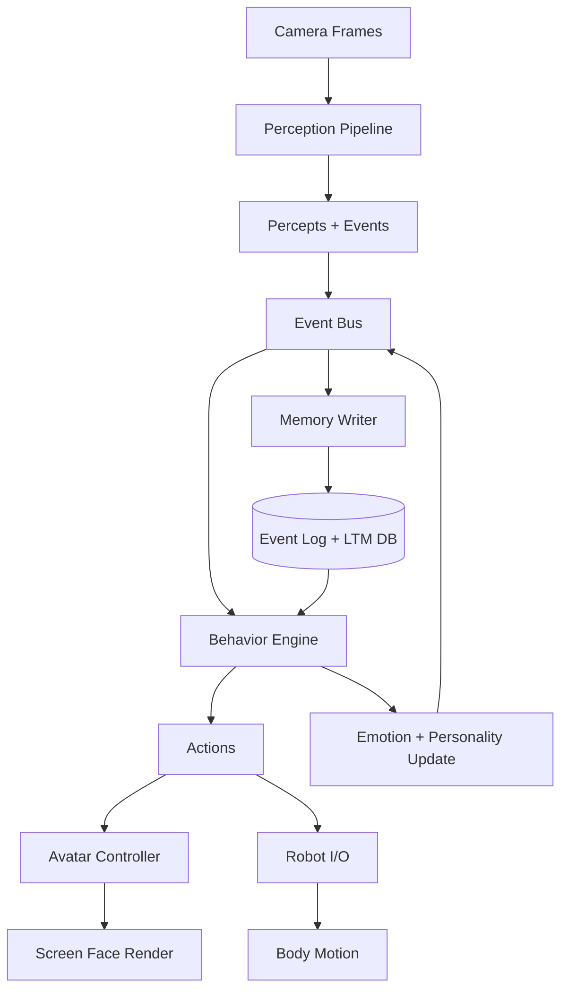
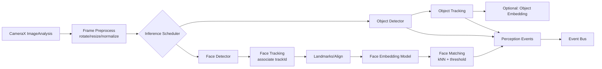
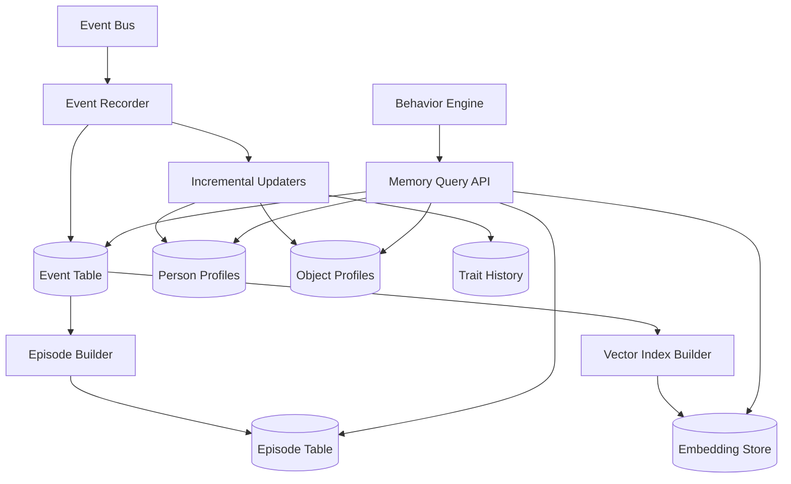
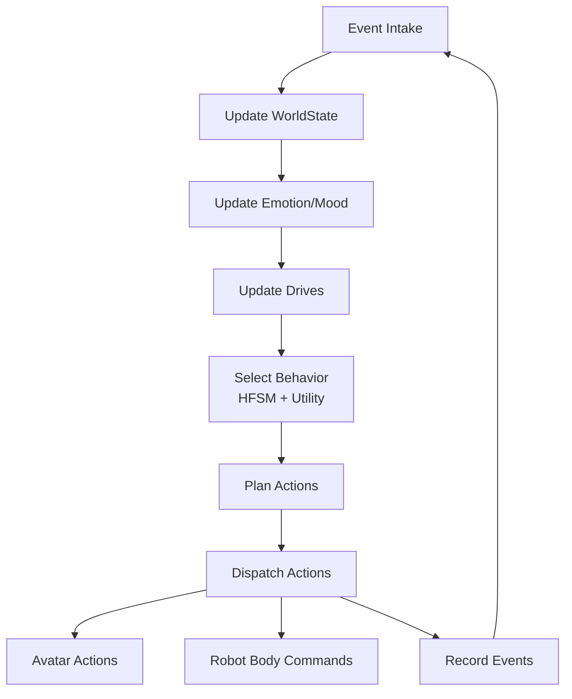

# Kiến trúc AI Pet Robot cho pha một

## Bối cảnh, mục tiêu và ràng buộc

Pha một đặt mục tiêu xây dựng một “não” chạy hoàn toàn **offline** trên điện thoại Android, dùng **camera của điện thoại** làm cảm biến thị giác chính và dùng **màn hình điện thoại** để hiển thị “khuôn mặt” (mắt, biểu cảm). Trọng tâm kỹ thuật trong pha này là:

- Nhận diện **người** (theo danh tính đã đăng ký) bằng nhận diện khuôn mặt chạy trên thiết bị (on-device).
- Nhận diện **đồ vật** (ít nhất theo lớp/nhãn, và có đường hướng mở rộng sang nhận diện “cùng một món đồ”).
- Ghi nhớ và truy hồi các tương tác theo thời gian, có hệ thống sự kiện (event log) rõ ràng.
- Hình thành “tính cách” theo thời gian (cập nhật dần dần dựa trên trải nghiệm), và có một bộ máy hành vi (behavior engine) điều phối biểu cảm + hành động robot.

Tài liệu này thiết kế kiến trúc **đủ hoàn chỉnh cho pha một**, nhưng vẫn chuẩn bị các “điểm móc” (extension points) để mở rộng sang pha sau như âm thanh, hiểu ngôn ngữ, multi-sensor, học cá nhân hóa nâng cao, v.v.

Các lựa chọn công nghệ chính trong kiến trúc bám theo tài liệu chính chủ của Android về hướng dẫn kiến trúc ứng dụng theo lớp (UI / domain / data), coroutines/Flow, đa module, lưu trữ Room/DataStore và xử lý camera bằng CameraX. citeturn4search0turn4search3turn4search12turn4search2turn4search8turn1search0turn0search5turn0search0

## Tổng quan hệ thống và luồng dữ liệu

### Thành phần vật lý và vai trò điện thoại

Trong pha một, điện thoại đảm nhiệm:

- Thu hình camera, suy luận thị giác (face/object), hợp nhất kết quả thành “nhận thức” (percepts).
- Cập nhật trí nhớ, hình thành trạng thái cảm xúc/tính cách, ra quyết định hành vi.
- Hiển thị avatar (mắt, biểu cảm) trên màn hình.
- Gửi lệnh điều khiển thân robot (nếu có) qua một lớp Robot I/O (BLE/USB/UART qua bridge), nhưng **điều khiển thời gian thực mức thấp** (PID motor, đọc encoder) nên để vi điều khiển/board thân robot xử lý để giảm jitter (điện thoại chỉ gửi setpoint/behavior-level commands).

### Nguyên lý dòng chảy dữ liệu

Thiết kế theo hướng **event-driven** + **vòng lặp hành vi**:

1. **Perception Module** nhận khung hình từ CameraX và phát ra các sự kiện nhận thức (ví dụ FaceDetected, PersonRecognized, ObjectDetected…).
2. **Event System** phân phối sự kiện tới:
   - **Memory Module** (ghi log, cập nhật hồ sơ người/đồ vật, tạo episode).
   - **Brain/Behavior Module** (cập nhật “nhận thức hiện tại”, cảm xúc, chọn hành vi).
3. **Behavior Engine** phát ra “ý định hành động” (Action/Command) tới:
   - **UI Avatar Module** (biểu cảm, hướng nhìn, blink, idle animation).
   - **Robot I/O Module** (chuyển động/gaze nếu có cơ cấu cơ khí).
4. Toàn bộ những gì quan trọng đều đi qua **Event Log** để truy vết, tái hiện, và học dần tính cách.

Kiểu kiến trúc này phù hợp với khuyến nghị về tách lớp UI/domain/data và dùng coroutines/Flow để truyền dữ liệu luồng (stream) trong Android. citeturn4search3turn4search0turn4search2turn4search8

### Sơ đồ vòng lặp hành vi



## Kiến trúc module Android và hợp đồng giao tiếp

### Nguyên tắc tổ chức đa module

Dùng kiến trúc **multi-module Gradle** để cô lập phụ thuộc, tăng tốc build, và giúp từng nhóm phát triển độc lập (perception/memory/avatar/behavior). Đây là hướng dẫn chính thức của Android về modularization. citeturn4search12

Ngoài ra, áp dụng tách lớp theo “guide to app architecture”: UI layer (render + UI state), domain layer (use-cases/logic ổn định), data layer (Room/DataStore/file). citeturn4search0turn4search3

### Danh sách module mức hệ thống

Dưới đây là bộ module “tối thiểu nhưng đủ” cho pha một (có thể gộp bớt nếu muốn MVP cực nhỏ, nhưng nên giữ ranh giới logic):

- **App Shell Module**
  - `:app`
  - Composition root: DI container, wiring event bus, lifecycle, permissions, màn hình chính.

- **Event System Module**
  - `:core:event`
  - Định nghĩa event types, event envelope, EventBus interface, recording policy.

- **Perception Module**
  - `:perception:camera`
    - Tích hợp CameraX Preview + ImageAnalysis (stream frame). CameraX ImageAnalysis cung cấp ảnh truy cập được bằng CPU để xử lý CV/ML và chạy `analyze()` cho mỗi frame. citeturn0search0
  - `:perception:vision-core`
    - Preprocess, frame scheduler, tracking, coordinate transforms.
  - `:perception:face`
    - Face detector, face landmark/align, face embedding, recognition logic.
    - Có thể dùng MediaPipe Face Detector/Face Landmarker hoặc pipeline custom. MediaPipe cung cấp “tasks” cho face detection/landmarks và chạy theo ảnh tĩnh hoặc video stream. citeturn2search16turn0search19
  - `:perception:object`
    - Object detector + (tuỳ chọn) object re-identification embedding.
    - MediaPipe Object Detector task hỗ trợ ảnh tĩnh hoặc video stream và trả về danh sách detection. citeturn1search6

- **Memory Module**
  - `:memory:domain`
    - Khái niệm Memory API: Working Memory, Episodic/Semantic store, retrieval.
  - `:memory:data`
    - Room database, migrations, DAO.
    - Room là lớp trừu tượng trên SQLite để lưu dữ liệu cấu trúc cục bộ. citeturn1search0
  - `:memory:index`
    - Vector search (brute-force pha một; HNSW/ANN pha sau).

- **Brain / Behavior Module**
  - `:brain:domain`
    - Emotion model, personality model, drives, behavior policies.
  - `:brain:engine`
    - HFSM/Utility selector + action planner.

- **UI Avatar Module**
  - `:avatar:ui`
    - Render “mặt robot” và điều khiển biểu cảm.
    - Compose animation API dùng cho chuyển cảnh/biểu cảm mượt. citeturn1search3
  - `:avatar:assets`
    - Vector shapes, sprite sheets, tham số rig.

- **Robot I/O Module**
  - `:robot:io`
    - Giao thức gửi command (BLE/USB), retry, health-check.
  - `:robot:protocol`
    - Định nghĩa message schema (protobuf/CBOR).

- **Core Platform Modules**
  - `:core:common` (logging, time, math, result types)
  - `:core:ml` (TFLite runtime wrappers, delegates)
    - TFLite `Interpreter` là driver thực thi inference cho model on-device. citeturn1search8
    - GPU delegate và NNAPI delegate dùng để tăng tốc (cấu hình tuỳ máy). citeturn0search7turn0search1
  - `:core:settings`
    - DataStore cho cấu hình/traits; DataStore dùng coroutines/Flow và hỗ trợ lưu nhất quán, “transactional”. citeturn0search5

### Hợp đồng dữ liệu giữa các module

Thiết kế theo “typed contracts” để tránh phụ thuộc chéo:

- `PerceptionOutput` → event bus:
  - `FaceTrackUpdate(trackId, bbox, landmarks?, quality, timestamp)`
  - `PersonRecognition(trackId, personId?, confidence, embeddingHash, timestamp)`
  - `ObjectDetections(list<det>, timestamp)`

- `MemoryAPI`
  - `recordEvent(event)`
  - `upsertPerson(personCandidate)`
  - `queryRecentEpisodes(filter)`
  - `getPersonProfile(personId)`
  - `findNearestFace(embedding)` (pha một brute-force)

- `BehaviorAPI`
  - `onEvent(event)`
  - `tick(now)` → `ActionBundle`

- `AvatarAPI`
  - `render(AvatarState)` (state-driven)
  - `applyAction(AvatarAction)` (event-driven)

Cầu nối chạy bằng Kotlin coroutines + Flow/SharedFlow phù hợp cho luồng sự kiện và cập nhật real-time trong Android. citeturn4search2turn4search8

## Pipeline nhận thức camera, nhận diện mặt và nhận diện đồ vật

### Pipeline camera và điều độ suy luận

CameraX dùng `ImageAnalysis` để lấy frame; một scheduler điều tiết để giữ ổn định FPS suy luận và không làm nghẽn UI:

- Preview: full frame cho hiển thị (nếu cần debug).
- Analysis: downscale + YUV→RGB (hoặc trực tiếp YUV nếu model hỗ trợ) cho inference.
- **Frame gating**: không chạy mọi model ở mọi frame:
  - Face detection: mỗi 2–3 frame (tuỳ tải).
  - Face embedding: chỉ khi track ổn định và quality đủ.
  - Object detection: mỗi 3–5 frame; tracking ở giữa.
- **Backpressure**: chỉ giữ “latest frame” để giảm độ trễ.

CameraX nêu rõ ImageAnalysis cung cấp ảnh truy cập CPU cho CV/ML và gọi `analyze()` mỗi frame. citeturn0search0

### Sơ đồ perception pipeline



### Kiến trúc nhận diện khuôn mặt

Trong pha một, cách thực tế và “đủ tốt” là tách thành bốn tầng:

#### Tầng phát hiện và landmarks

- **Face detector**: dùng MediaPipe Face Detector (BlazeFace-based) hoặc detector TFLite tương đương.
  - MediaPipe Face Detection mô tả là “ultrafast” và dựa trên BlazeFace, hướng tới inference trên GPU di động. citeturn0search15turn2search4
- **Face landmarker**: nếu cần align và/hoặc biểu cảm, dùng MediaPipe Face Landmarker; nó hỗ trợ ảnh tĩnh và video stream. citeturn0search19
- Nếu mục tiêu là rig biểu cảm chi tiết (mắt/mày/môi), có thể tham chiếu Face Mesh; MediaPipe Face Mesh ước lượng 468 landmarks thời gian thực trên thiết bị di động. citeturn0search11

#### Tầng embedding

- Dùng một model embedding “gọn” chạy offline:
  - FaceNet là hệ embedding đưa ảnh khuôn mặt vào không gian Euclid để đo khoảng cách và làm recognition/clustering. citeturn2search1turn2search9
  - MobileFaceNets được thiết kế riêng cho mobile/embedded, rất ít tham số và hướng tới face verification real-time. citeturn2search0
  - ArcFace là kỹ thuật loss để tăng phân tách lớp embedding; hữu ích ở tầng huấn luyện (bạn dùng model đã huấn luyện sẵn). citeturn2search2turn2search10

**Khuyến nghị pha một**: ưu tiên MobileFaceNet-style embedding (nhẹ), output 128D hoặc 192D, quantized nếu cần.

#### Tầng matching và quản lý danh tính

- Với mỗi `personId`, lưu **nhiều template embedding** (nhiều điều kiện ánh sáng/góc).
- Matching:
  - Khoảng cách cosine hoặc L2.
  - `best = argmin(dist(e, template))`
  - Nếu dist < threshold: coi là `recognized`.
- Với số lượng người nhỏ (ví dụ < 50) và template mỗi người < 20, brute-force vẫn ổn trong pha một. Khi mở rộng, chuyển sang ANN (HNSW) ở module `:memory:index`.

#### Tầng “enrollment” (đăng ký người)

Vì đây là robot offline, cần UX để người dùng “dạy” robot:

- Khi track mặt ổn định:
  - Chụp một vài crops (3–10) → tạo embedding → lưu `FaceTemplate`.
- Người dùng đặt tên cho người đó (hoặc chọn “Chủ”).
- Cập nhật `familiarity_score` theo số lần gặp gần đây và chất lượng recognition.

### Kiến trúc nhận diện đồ vật

Trong pha một có hai cấp nhận diện, nên tách rõ:

#### Nhận diện theo lớp (class-level)

- Dùng MediaPipe Object Detector:
  - Task này phát hiện vị trí và lớp của nhiều đối tượng trong ảnh/video stream. citeturn1search6
  - Có thể dùng example Android để tham khảo tích hợp camera và stream detection. citeturn1search2
- Đây là mức “đủ tối thiểu” để nói robot “thấy bóng / gấu bông / chai nước…”.

Nếu bạn cần lớp đồ vật riêng (ví dụ “đồ chơi của mình”), MediaPipe hỗ trợ hướng tùy biến model bằng Model Maker (tức bạn chuẩn bị data và fine-tune ngoài thiết bị; pha một vẫn offline khi chạy). citeturn1search18

#### Nhận diện theo “cùng một món đồ” (instance-level, tuỳ chọn pha một)

Để “nhớ món đồ” thay vì chỉ “nhớ lớp”, thêm một tầng embedding cho ROI của object:

- ROI crop theo bbox → đưa qua một image embedding nhỏ (MobileNet-like) để lấy vector.
- Lưu `ObjectTemplate` cho object mà người dùng gán nhãn (“Bóng của Tí”).
- Matching tương tự face: nearest neighbor + threshold.

Pha một có thể **chưa bắt buộc** làm instance-level cho mọi vật; chỉ áp dụng với “vật kỷ niệm” (món đồ được người dùng gán nhãn).

### Runtime ML offline và tăng tốc

- TFLite `Interpreter` là lõi chạy inference cho model offline. citeturn1search8
- Bật GPU delegate khi phù hợp để tăng tốc; tài liệu hướng dẫn cấu hình GPU delegate cho Android. citeturn0search7
- Dùng NNAPI delegate (tuỳ thiết bị) nếu profiling cho thấy lợi ích; có tài liệu cách dùng NNAPI delegate trong TFLite. citeturn0search1

Lưu ý thực tế: tăng tốc (GPU/NNAPI) không luôn nhanh hơn CPU trong mọi trường hợp; cần profiling theo model và thiết bị. (Khuyến nghị này mang tính kỹ thuật thực hành; bạn nên benchmark trước khi “khóa” cấu hình delegate.)

## Trí nhớ, cơ sở dữ liệu, long-term memory và hệ event log

### Thiết kế tầng trí nhớ

Đề xuất bộ nhớ thành bốn lớp để rõ trách nhiệm:

- **Working Memory (WM)**: in-memory, trạng thái hiện tại (ai đang ở trước mặt, đồ vật vừa thấy, hành vi hiện tại, cảm xúc tức thời).
- **Short-term Event Buffer (STB)**: ring buffer vài phút gần nhất để behavior suy luận nhanh, không query DB liên tục.
- **Long-term Memory (LTM)**: Room DB lưu bền vững (people, objects, templates, episodes, events).
- **Derived Memory (DM)**: bảng tổng hợp (familiarity, statistics), embeddings centroid, episode summaries.

Room phù hợp cho LTM vì cung cấp abstraction trên SQLite và hướng tới lưu trữ offline. citeturn1search0

### Sơ đồ memory system



### Event log system

Event log là “xương sống” để:

- Giải thích vì sao robot làm hành vi A.
- Tái hiện lại tương tác (memory recall).
- Cập nhật dần tính cách (trait update) dựa trên lịch sử.
- Debug và đánh giá (offline telemetry nội bộ).

**Envelope chuẩn cho Event** (khuyến nghị):

- `eventId: UUID`
- `timestampMs: Long`
- `sessionId: UUID` (từ lúc app/robot “thức” đến “ngủ”, hoặc một ca chơi)
- `source: ModuleId`
- `type: EventType`
- `importance: Int` (0–100)
- `refPersonId?`, `refObjectId?`, `trackId?`
- `emotionSnapshot?` (valence/arousal/dominance)
- `payload: JSON/Proto` (đủ để tái dựng)

#### Nhóm event types (pha một)

Tối thiểu nên có các nhóm sau:

- **Perception**
  - `FaceDetected`, `FaceTrackUpdated`, `PersonRecognized`, `PersonLost`
  - `ObjectDetected`, `ObjectTrackUpdated`, `ObjectLost`
- **Interaction**
  - `UserLabeledPerson`, `UserLabeledObject`
  - `UserPositiveFeedback`, `UserNegativeFeedback` (pha một có thể chỉ là nút “thích/không thích”)
- **Behavior**
  - `BehaviorStateEntered`, `BehaviorStateExited`
  - `ActionIssued`, `ActionCompleted`, `ActionFailed`
- **Affect**
  - `EmotionUpdated`, `MoodUpdated`
  - `TraitUpdated` (tính cách)
- **System**
  - `AppStarted`, `SessionStarted`, `SessionEnded`
  - `ThermalWarning`, `BatteryLow`, `ModelLoadFailed`

### Long-term memory design

LTM chia thành ba loại lưu trữ:

- **Hồ sơ thực thể (entities)**: người và đồ vật.
- **Dấu vết tương tác (events/episodes)**: event log chi tiết + episode tổng hợp.
- **Chỉ mục vector (embeddings)**: template face/object.

Nếu nhu cầu mở rộng về sau (nhiều nghìn template), cần module index ANN. Nhưng pha một ưu tiên đơn giản, kiểm soát đúng hơn.

### Database schema

Pha một nên dùng Room (SQLite) cho dữ liệu cấu trúc; và DataStore cho cấu hình/trait scalar. DataStore là giải pháp lưu key-value/proto typed objects dựa trên coroutines/Flow. citeturn0search5

#### DDL gợi ý (SQLite/Room)

```sql
-- People
CREATE TABLE person (
  person_id TEXT PRIMARY KEY,
  display_name TEXT NOT NULL,
  role TEXT NOT NULL DEFAULT 'unknown', -- owner|family|friend|unknown
  created_at_ms INTEGER NOT NULL,
  last_seen_at_ms INTEGER,
  familiarity REAL NOT NULL DEFAULT 0.0,
  notes TEXT
);

CREATE TABLE face_template (
  template_id TEXT PRIMARY KEY,
  person_id TEXT NOT NULL,
  created_at_ms INTEGER NOT NULL,
  updated_at_ms INTEGER,
  embedding BLOB NOT NULL,            -- float32[] or int8[] packed
  embedding_dim INTEGER NOT NULL,
  distance_metric TEXT NOT NULL,      -- 'cosine' | 'l2'
  quality REAL NOT NULL DEFAULT 0.0,  -- 0..1
  source_event_id TEXT,
  FOREIGN KEY(person_id) REFERENCES person(person_id)
);

-- Objects
CREATE TABLE object_entity (
  object_id TEXT PRIMARY KEY,
  display_name TEXT,                  -- user label, nullable
  category TEXT NOT NULL,             -- e.g. 'toy', 'bottle'
  created_at_ms INTEGER NOT NULL,
  last_seen_at_ms INTEGER,
  familiarity REAL NOT NULL DEFAULT 0.0,
  notes TEXT
);

CREATE TABLE object_template (
  template_id TEXT PRIMARY KEY,
  object_id TEXT NOT NULL,
  created_at_ms INTEGER NOT NULL,
  embedding BLOB NOT NULL,
  embedding_dim INTEGER NOT NULL,
  detector_label TEXT NOT NULL,        -- class label from detector
  quality REAL NOT NULL DEFAULT 0.0,
  source_event_id TEXT,
  FOREIGN KEY(object_id) REFERENCES object_entity(object_id)
);

-- Event log
CREATE TABLE event_log (
  event_id TEXT PRIMARY KEY,
  ts_ms INTEGER NOT NULL,
  session_id TEXT NOT NULL,
  source TEXT NOT NULL,
  type TEXT NOT NULL,
  importance INTEGER NOT NULL DEFAULT 0,
  person_id TEXT,
  object_id TEXT,
  track_id TEXT,
  valence REAL,
  arousal REAL,
  dominance REAL,
  payload_json TEXT NOT NULL,
  FOREIGN KEY(person_id) REFERENCES person(person_id),
  FOREIGN KEY(object_id) REFERENCES object_entity(object_id)
);

CREATE INDEX idx_event_ts ON event_log(ts_ms);
CREATE INDEX idx_event_type_ts ON event_log(type, ts_ms);
CREATE INDEX idx_event_person_ts ON event_log(person_id, ts_ms);
CREATE INDEX idx_event_object_ts ON event_log(object_id, ts_ms);

-- Episodes (summaries)
CREATE TABLE episode (
  episode_id TEXT PRIMARY KEY,
  start_ts_ms INTEGER NOT NULL,
  end_ts_ms INTEGER NOT NULL,
  primary_person_id TEXT,
  primary_object_id TEXT,
  summary TEXT NOT NULL,
  importance INTEGER NOT NULL DEFAULT 0,
  FOREIGN KEY(primary_person_id) REFERENCES person(person_id),
  FOREIGN KEY(primary_object_id) REFERENCES object_entity(object_id)
);

-- Affect snapshots (optional history)
CREATE TABLE trait_history (
  id TEXT PRIMARY KEY,
  ts_ms INTEGER NOT NULL,
  trait_name TEXT NOT NULL,
  value REAL NOT NULL,
  reason_event_id TEXT
);

CREATE TABLE emotion_history (
  id TEXT PRIMARY KEY,
  ts_ms INTEGER NOT NULL,
  valence REAL NOT NULL,
  arousal REAL NOT NULL,
  dominance REAL NOT NULL,
  reason_event_id TEXT
);
```

#### Ghi chú lưu trữ embedding

- `embedding` có thể là:
  - float32 packed (dễ debug, tốn dung lượng)
  - int8 quantized (tiết kiệm, cần dequant khi tính distance)
- Nên lưu thêm `quality` để bỏ template xấu.
- Pha một brute-force: đọc templates theo person/object, tính distance.

### Cấu trúc memory cho người và đồ vật

Khuyến nghị có cả dạng “DB entity” và dạng “runtime profile”:

**PersonProfile (runtime)**  
- `personId`, `displayName`, `role`
- `familiarity` (EMA theo lần gặp)
- `lastSeenAt`
- `faceCentroidEmbedding` (tính từ templates chất lượng cao)
- `interactionStats`:
  - `greetCount`, `playCount`, `negativeFeedbackCount`
  - `avgSessionDuration`
- `affectiveAssociation`:
  - “người này thường làm robot vui hay căng thẳng” → thống kê PAD theo events gắn personId

**ObjectProfile (runtime)**  
- `objectId`, `displayName?`, `category`
- `familiarity`, `lastSeenAt`
- `objectCentroidEmbedding?` (nếu instance-level)
- `usageStats` (đồ vật hay được chơi cùng ai, thời lượng)

### Tác vụ nền và “dọn trí nhớ”

Trong pha một, vẫn cần một số tác vụ chạy nền nhưng không đòi hỏi thời gian thực:

- Gộp event → episode (mỗi 5–10 phút hoặc khi session kết thúc)
- Nén/loại template kém chất lượng
- Tái tính centroid embeddings
- Xoá event quá cũ theo chính sách

WorkManager phù hợp cho “deferrable, asynchronous tasks” chạy tin cậy theo điều kiện hệ thống. citeturn0search2

## Mô hình nhân cách, cảm xúc, behavior engine và avatar animation

### Personality trait model

Để “robot phát triển tính cách”, cần tách:

- **Traits**: chậm đổi, là “tính cách” dài hạn.
- **Mood**: đổi theo giờ/ngày (nhanh hơn traits).
- **Emotion**: phản ứng tức thời theo sự kiện.

#### Lõi traits theo Big Five (khuyến nghị có giải thích khoa học)

Dùng Five-Factor Model (Big Five: Extraversion, Agreeableness, Conscientiousness, Neuroticism, Openness). Đây là mô hình được mô tả rộng rãi và có nền tảng nghiên cứu mạnh. citeturn3search4turn3search13

Trong robot, ta không cần “đúng như người”, mà dùng Big Five như **vector tham số** để điều chỉnh:

- **Extraversion**: mức chủ động tiếp cận người, tần suất “chào”, seek attention.
- **Agreeableness**: mức “hiền”, ưu tiên tương tác xã hội hơn khám phá.
- **Conscientiousness**: mức “ngăn nắp”, quay lại trạng thái idle ổn định, bám quy tắc (ví dụ không quậy khi bị feedback xấu).
- **Neuroticism** (đảo nghĩa thành “emotional volatility”): độ nhạy với sự kiện lạ, dễ “lo”.
- **Openness**: ham khám phá, thích đồ vật mới.

#### Traits “pet-specific” (thực dụng cho sản phẩm)

Bên cạnh Big Five, thêm vài traits nội bộ (0..1) để điều khiển avatar/behavior rõ ràng hơn:

- `playfulness`
- `attachment_to_owner`
- `curiosity`
- `confidence`

Các trait này có thể được coi là hàm của Big Five + lịch sử tương tác, nhưng lưu riêng sẽ thực dụng hơn trong pha một.

#### Cập nhật traits dần dần (incremental learning)

Pha một không cần ML phức tạp; dùng cập nhật kiểu EMA có “learning rate” rất nhỏ:

- `trait = (1 - α) * trait + α * delta(event)`
- α phụ thuộc “độ quan trọng” và độ hiếm của event (feedback của chủ α lớn hơn).

Quan trọng: traits phải **ổn định** và khó thay đổi nhanh, nếu không robot sẽ “tính cách thất thường” và gây khó chịu.

### Emotion model

Đề xuất PAD (Pleasure–Arousal–Dominance) vì:

- Có thể biểu diễn cảm xúc như một vector liên tục, dễ nội suy vào biểu cảm avatar.
- “Dominance” rất hợp cho robot (cảm giác kiểm soát/tự tin). Mô hình PAD được Mehrabian trình bày như khung mô tả trạng thái cảm xúc theo ba chiều. citeturn3search14turn3search2

Ngoài ra, bạn có thể tham chiếu OCC (Ortony–Clore–Collins) nếu muốn cảm xúc dựa trên “đánh giá sự kiện” (appraisal) theo cấu trúc nhận thức; có tài liệu tổng quan/bàn luận về OCC. citeturn3search3turn3search15  
Trong pha một, PAD + một vài rule appraisal đơn giản là đủ.

#### Quy tắc cập nhật emotion (pha một)

Ví dụ rule-based:

- Thấy **chủ** (recognized owner):
  - `pleasure +`, `arousal + nhẹ`, `dominance +`
- Thấy người lạ:
  - `arousal +`, `dominance - nhẹ` (thận trọng)
- Thấy đồ chơi yêu thích:
  - `pleasure +`, `arousal +`
- Bị feedback xấu:
  - `pleasure -`, `dominance -`, `arousal +` (bối rối)

Emotion nên có “decay” về baseline mood theo thời gian.

### Behavior engine

#### Kiến trúc điều khiển

Pha một khuyến nghị: **HFSM + Utility scorer**:

- HFSM để predictable và dễ debug.
- Utility scorer để lựa chọn giữa các hành vi ngang cấp (ví dụ Explore vs SeekAttention), dựa trên drives và personality.

**Các thành phần chính:**

- `WorldState` (từ perception + memory):
  - `visiblePersons`, `visibleObjects`, `isOwnerPresent`, `timeSinceLastInteraction`, `batteryState`…
- `Drives` (0..1):
  - `socialDrive`, `playDrive`, `exploreDrive`, `restDrive`
- `AffectState`:
  - `emotionPAD`, `moodPAD`, `traits`

**Policy tổng quát:**
- `utility(behavior) = w1*drive + w2*traitAlignment + w3*context + w4*safety`

#### Behavior state machine (pha một)

Các trạng thái lõi:

- `Boot`
- `Idle`
- `SeekAttention`
- `GreetKnownPerson`
- `GreetUnknownPerson` (có thể chỉ “curious look”)
- `Observe`
- `PlayWithObject`
- `Explore`
- `Rest`
- `ErrorRecovery`

Chuyển trạng thái dựa trên event + timers + drives.

Ví dụ:
- `Idle` → `GreetKnownPerson` khi nhận event `PersonRecognized(owner|friend)` và `arousal` không quá thấp.
- `Idle` → `SeekAttention` khi `timeSinceLastInteraction > T` và `socialDrive` cao.
- `Observe` → `PlayWithObject` khi object thuộc “favorite” và `playDrive` cao.
- Bất kỳ → `Rest` khi thermal/battery báo cần giảm tải.

#### Sơ đồ behavior loop



### Avatar animation system

Mục tiêu avatar trong pha một: “mắt sống”, biểu cảm rõ, phản ứng theo recognition/mood.

#### Kiến trúc

- `AvatarState` (stateful, render-driven):
  - `expression` (happy/curious/sleepy/neutral…)
  - `eyeGaze` (x,y) theo vị trí mặt/người trong frame
  - `blinkRate`, `pupilSize`, `mouthCurve`, `browTilt`
  - `idleNoise` (micro-motions)
- `AvatarController`
  - Nhận `AvatarAction` từ Behavior Engine
  - Nhận `EmotionUpdated` để blend biểu cảm
  - Sinh tham số liên tục (smoothing, easing)
- `Renderer`
  - Compose Canvas / vector shapes
  - Animations dùng Compose APIs (Animated*AsState, AnimatedContent…) để chuyển trạng thái mượt. citeturn1search3

#### Mapping emotion → biểu cảm (pha một)

- PAD → các “blend weights”:
  - Pleasure cao → happy eyes, mouth up
  - Arousal cao → mắt mở to, blink nhanh
  - Dominance thấp → “shy/avoid gaze”, nhìn lệch

Quan trọng: Avatar nên có “idle breathing” để trông sống, nhưng phải nhẹ để không gây mệt.

## MVP tối thiểu cho pha một

MVP phải đạt đủ các ràng buộc cốt lõi: offline, nhận diện người/đồ vật, ghi nhớ, có personality dần hình thành, có behavior loop và avatar biểu cảm.

### Phạm vi MVP đề xuất

**Nhận thức**
- CameraX ImageAnalysis stream.
- Face detector + tracker.
- Enrollment 1–3 người (ít nhất “Chủ”).
- Face recognition (kNN + threshold) với số lượng template nhỏ.
- Object detector (class-level) cho một tập lớp phổ biến (ví dụ: person, cat/dog, bottle, toy… tuỳ model).
- (Tuỳ chọn) “favorite object” bằng user labeling + object template (nếu làm kịp).

**Trí nhớ**
- Event log đầy đủ (Room).
- PersonProfile + Familiarity cập nhật theo lần gặp.
- Episode builder đơn giản: nhóm sự kiện theo cửa sổ thời gian (ví dụ 2–5 phút) và lưu `summary` dạng template text (chưa cần LLM).

**Tính cách & cảm xúc**
- Emotion PAD cập nhật rule-based + decay.
- Traits khởi tạo mặc định + cập nhật EMA khi có feedback (nút like/dislike sau một hành vi).
- Tính cách ảnh hưởng rõ rệt tới:
  - tần suất SeekAttention vs Explore
  - cường độ biểu cảm (mắt mở to, blink, v.v.)

**Hành vi**
- HFSM với 5–7 trạng thái: Boot, Idle, GreetKnown, Observe, SeekAttention, Rest, ErrorRecovery.
- Hành động đầu ra:
  - Avatar expression + gaze (bắt theo vị trí mặt trong ảnh)
  - (Nếu có thân robot) 2–3 command đơn giản: quay trái/phải, “nhún”, dừng.

**Avatar**
- Ít nhất 4 biểu cảm: neutral, happy, curious, sleepy.
- Blink ngẫu nhiên có điều khiển theo arousal.
- Gaze tracking (pupil shift) theo face bbox center.

### Những thứ nên hoãn sang pha sau (để MVP không vỡ)

- Nhận diện đồ vật “instance-level” cho mọi đồ vật.
- Tự học model on-device; dù TFLite có hướng nghiên cứu on-device training, pha một nên tránh rủi ro và tập trung inference ổn định. citeturn1search14
- Audio ASR/NLP phức tạp.
- Liveness/anti-spoof mạnh (chỉ làm tối thiểu nếu cần).

### Tiêu chí hoàn thành MVP (định lượng)

- Nhận diện đúng “Chủ” trong điều kiện ánh sáng bình thường với tỷ lệ thành công cao trong demo nội bộ (ví dụ > 90% với người đã enrollment).
- Event log truy vết được: xem lại “hôm nay robot gặp ai, thấy gì, phản ứng ra sao”.
- Tính cách thay đổi nhìn thấy được sau vài buổi tương tác (ví dụ: sau nhiều “like” khi robot chủ động chào, robot chủ động chào nhiều hơn).
- Avatar phản ứng mượt, không giật, không drop frame nghiêm trọng khi chạy inference (đạt trải nghiệm “sống”).

### Gợi ý triển khai theo lát cắt dọc

Để giảm rủi ro, triển khai theo “vertical slice”:

1. CameraX → FaceDetected → Avatar gaze (chưa recognition).
2. Thêm embedding + enrollment + PersonRecognized.
3. Thêm event log + person profile + familiarity.
4. Thêm emotion PAD → avatar expression.
5. Thêm behavior HFSM → hành vi có chủ đích.
6. Thêm object detection + memory đồ vật.

Các bước này đều dựa trên hạ tầng CameraX ImageAnalysis, Room, DataStore, WorkManager, coroutines/Flow, và runtime TFLite/MediaPipe tasks như đã trích dẫn. citeturn0search0turn1search0turn0search5turn0search2turn4search2turn4search8turn1search8turn2search16turn1search6