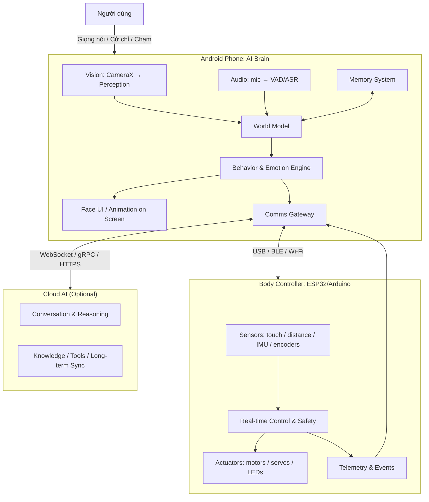
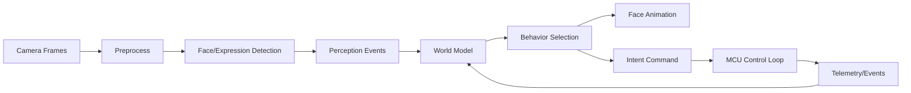
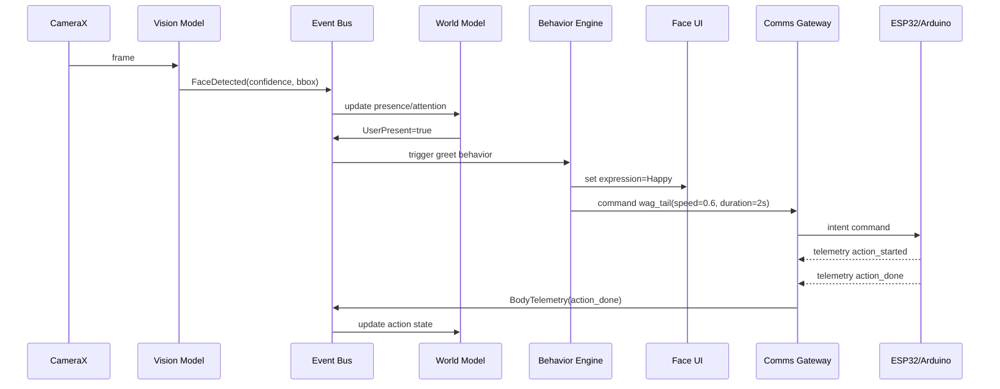
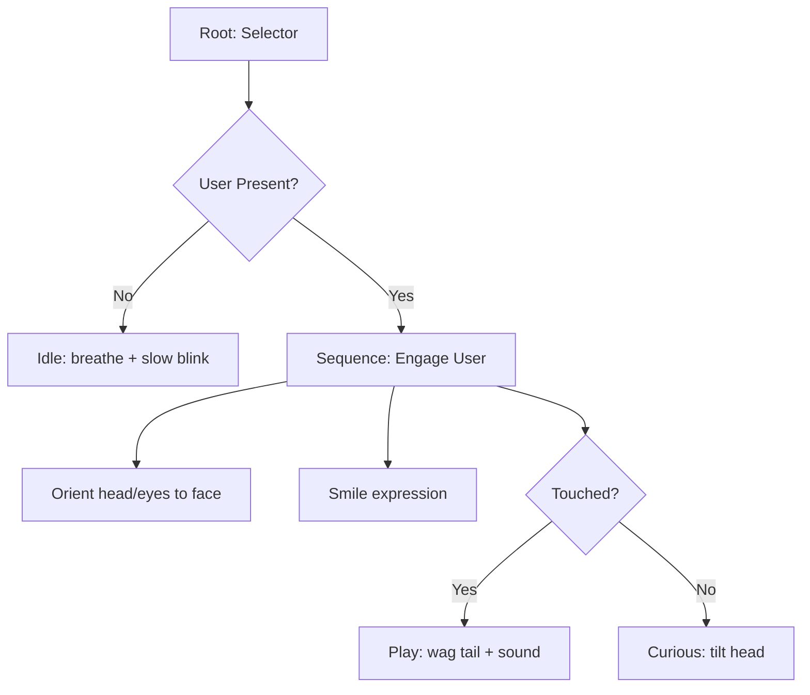

# Kiến trúc hệ thống AI Pet Robot dùng Android làm “não” và ESP32/Arduino làm bộ điều khiển thân

## Mục tiêu và ràng buộc thiết kế

**Mục tiêu sản phẩm.** AI Pet Robot là một “thú cưng” có tính xã hội: nhìn–nghe–phản hồi, thể hiện cảm xúc trên màn hình, ghi nhớ tương tác theo thời gian, và (ở giai đoạn thân robot) có thể cử động/tương tác bằng cảm biến–động cơ. Kiến trúc phải ưu tiên **tính phản hồi thời gian thực**, **an toàn**, **hoạt động ngoại tuyến hợp lý**, và **dễ mở rộng** theo 3 pha.

**Ràng buộc bắt buộc (theo đề bài).**
- **Android phone** là **não chính**: chạy perception, trí nhớ, điều khiển hành vi, UI gương mặt.
- **Camera điện thoại** dùng cho thị giác; **màn hình** dùng cho biểu cảm.
- **Arduino/ESP32** là **body controller**: đọc cảm biến thân và điều khiển động cơ theo vòng điều khiển cục bộ.
- **Cloud AI là tùy chọn** (pha 2), hệ thống vẫn phải chạy tối thiểu khi không có mạng.

**Nhận xét thẳng (để tránh “đụng tường” khi làm thật).** “Dùng điện thoại làm não” là hướng rất hợp lý để prototype nhanh (camera + mic + màn hình + GPU/NPU sẵn), nhưng bạn sẽ gặp các vấn đề: giới hạn chạy nền, nhiệt/throttling, quản trị năng lượng, và bất định về độ trễ khi điều khiển động cơ nếu làm trực tiếp trên Android. Vì vậy, kiến trúc cần **tách rõ**: Android ra quyết định mức cao, **ESP32/Arduino giữ vòng điều khiển mức thấp** để đảm bảo ổn định. Các hạn chế về foreground service/background start trên Android (đặc biệt từ Android 12+ và yêu cầu khai báo loại foreground service trên Android 14+) cần được tính như “yêu cầu hệ thống” chứ không phải chi tiết triển khai. citeturn0search5turn0search3turn0search13

**Nguyên tắc kiến trúc (cốt lõi để đi xa).**
- **Phân lớp điều khiển**: “High-level cognition” (Android) tách khỏi “Real-time control & safety” (MCU).
- **Event-driven**: mọi perception/sensor/đối thoại/hành động đều là sự kiện có timestamp; module subscribe theo nhu cầu.
- **Memory đa tầng**: short-term (RAM), episodic log (SQLite/Room), semantic memory (vector/embeddings), profile (DataStore), và (tùy chọn) cloud sync.
- **Graceful degradation**: mất mạng → vẫn tương tác cục bộ (cử động cơ bản, nhận diện mặt/biểu cảm, ghi nhớ cục bộ).
- **Observability**: log, replay, và “flight recorder” cho debug hành vi.

---

## Kiến trúc tổng thể theo ba pha

Phần này trả lời trực tiếp mục **Overall system architecture** và khung tiến hóa theo pha.

### Tầm nhìn kiến trúc qua 3 pha

- **Pha 1 — Android AI brain (perception + memory)**  
  Chạy pipeline camera/mic → trích xuất tín hiệu (mặt, biểu cảm, chú ý, âm thanh) → cập nhật “world state” + memory → phát hành sự kiện → UI biểu cảm trên màn hình.
  - Camera nên dùng **CameraX** để có API nhất quán, dễ ghép use-case và bám lifecycle, tương thích rộng (tới Android 5.0/API 21). citeturn0search8turn0search0
  - Perception có thể bắt đầu với **ML Kit Face Detection** (chạy on-device, đủ nhanh cho real-time). citeturn2search0turn2search4

- **Pha 2 — Cloud AI integration (tùy chọn)**  
  Thêm lớp “Conversation & Intelligence” trên cloud (LLM + tools + knowledge). Kênh giao tiếp thời gian thực có thể dùng **WebSocket** (full-duplex, handshake + framing trên TCP) hoặc **gRPC trên HTTP/2** tùy nhu cầu. citeturn5search1turn5search2  
  Ở pha này, kiến trúc phải đảm bảo: cloud là **augmentation**, không biến hệ thống thành “lúc chạy lúc không”.

- **Pha 3 — Physical robot body (motors + sensors)**  
  Điện thoại gắn trên thân (dock), màn hình làm “mặt”, camera làm “mắt”. MCU (ESP32/Arduino) đọc cảm biến (chạm, khoảng cách, encoder…) và điều khiển động cơ/servo. Android gửi “ý định” (intent) chứ không gửi PWM trực tiếp; MCU thực thi và phản hồi trạng thái/sự kiện.

### Sơ đồ kiến trúc tổng thể



Các “điểm neo” kỹ thuật quan trọng của sơ đồ:
- Camera pipeline nên được **bind theo lifecycle** để tránh rò rỉ/treo camera và quản trị tài nguyên tốt hơn. citeturn0search0  
- Cloud real-time: WebSocket là full-duplex kênh hai chiều; gRPC định nghĩa rõ giao thức chạy trên HTTP/2 framing. citeturn5search1turn5search2

---

## Kiến trúc thành phần và phần cứng

Phần này bao phủ **Component architecture** và **Hardware architecture**.

### Kiến trúc thành phần (Android Brain)

**Khuyến nghị cấu trúc app dạng “layered + ports/adapters”:**
- **Perception Layer**
  - Vision Ingest (CameraX) citeturn0search8
  - Vision Models: face detect, face landmarks/expression
    - ML Kit Face Detection (on-device, realtime) citeturn2search0
    - MediaPipe Face Landmarker (landmarks + facial expressions, hỗ trợ stream) citeturn2search2
  - Audio Ingest: AudioRecord/VAD (tùy chọn), Speech recognizer/TTS
- **Cognition Layer**
  - World Model (state hiện tại)
  - Memory Manager (STM/episodic/semantic/profile)
  - Behavior Engine (BT/HFSM + emotion)
  - Conversation Orchestrator (local/offline + cloud augmentation)
- **Interaction Layer**
  - Face Renderer (Compose/Canvas/OpenGL tuỳ chọn)
  - Speech Output (TextToSpeech) citeturn3search0turn3search4
  - Sound/earcons/haptics
- **Comms Gateway**
  - Link tới MCU (USB/BLE/Wi‑Fi)
  - Link tới cloud (WebSocket/gRPC/HTTPS)
- **System Services**
  - Task scheduling (WorkManager) và/hoặc foreground service cho hoạt động dài (điều kiện pháp lý của Android) citeturn3search12turn0search5turn0search3

### Kiến trúc thành phần (Body Controller: ESP32/Arduino)

**MCU firmware nên chia rõ:**
- **RT Control Loop**: PWM/servo update, motor PID, đọc encoder, watchdog.
- **Sensor Fusion cơ bản**: lọc nhiễu, debounce touch, threshold distance.
- **Safety Supervisor**: giới hạn dòng, giới hạn góc servo, e-stop logic.
- **Transport**: driver USB-serial/UART/BLE/Wi‑Fi tuỳ cấu hình, đóng gói gói tin.
- **Telemetry & Event Emitter**: phát event “bump”, “picked_up”, “stall”, “battery_low”…

Về lựa chọn chip:
- Dòng ESP32 có thể đóng vai “standalone hoặc slave”, giao tiếp với host qua SPI/SDIO/I2C/UART. citeturn1search4  
- Một số module (ví dụ ESP32-S3) được mô tả có Wi‑Fi + Bluetooth LE, nhiều peripheral và hỗ trợ tăng tốc cho một số workload NN/DSP (hữu ích nếu tương lai muốn đẩy wake word hoặc xử lý tín hiệu xuống MCU). citeturn1search0  
- UART là giao thức nối tiếp phổ biến, TX/RX full-duplex, là nền tảng Serial trên Arduino và phổ dụng trong embedded. citeturn1search9turn1search17

### Sơ đồ component (logic)

```mermaid
flowchart LR
  subgraph AND["Android App"]
    BUS[(Event Bus)]
    CAM[CameraX Ingest] --> BUS
    MIC[Audio Ingest] --> BUS
    VISION[Vision Models] --> BUS
    WM[World Model] <--> BUS
    MEM[Memory Manager] <--> BUS
    BEH[Behavior Engine] <--> BUS
    UI[Face Renderer] <-- BUS
    TTS[TextToSpeech] <-- BUS
    GW[Comms Gateway] <--> BUS
  end

  subgraph CTRL["ESP32/Arduino Firmware"]
    RXTX[Transport + Parser]
    RT[RT Motor Control]
    SNS[Sensor Readout]
    SAFE[Safety Supervisor]
    EVT[Event/Telemetry]
    RXTX --> RT
    RXTX --> SAFE
    SNS --> SAFE
    SNS --> EVT
    RT --> EVT
  end

  GW <--> |USB/BLE/Wi‑Fi| RXTX
```

### Sơ đồ phần cứng pha 3 (block diagram)

```mermaid
flowchart TB
  PHONE[Android Phone\nScreen=Face, Camera=Vision, Mic/Speaker] -->|USB-C power + data OR BLE/Wi‑Fi| MCU[ESP32/Arduino]

  MCU --> MD[Motor/Servo Drivers]
  MD --> MTR[Motors/Servos]

  MCU --> SENS[Body Sensors\n(touch, distance, imu, encoders)]
  MCU --> PWR[Power mgmt\nbattery, charger, regulators]

  PWR --> MCU
  PWR --> MD
  PWR --> PHONE
```

---

## Dòng dữ liệu và kiến trúc hướng sự kiện

Phần này bao phủ **Data flow between components** và **Event-driven architecture**.

### Dòng dữ liệu chính (perception → cognition → actuation)

Luồng tối thiểu để robot “có hồn” (offline-friendly):
1. CameraX cung cấp frame theo use-case và lifecycle. citeturn0search8turn0search0  
2. Vision models phát hiện mặt/điểm mốc/biểu cảm; ML Kit được thiết kế chạy on-device và đủ nhanh cho real-time; MediaPipe Face Landmarker hỗ trợ stream và mô tả rõ việc suy ra facial expressions. citeturn2search0turn2search2  
3. World Model cập nhật “attention target”, “user present?”, “emotion cues”.  
4. Behavior Engine chọn hành vi: nhìn theo, chớp mắt, “vẫy đuôi”, phát âm thanh, đổi biểu cảm trên màn hình.
5. Comms Gateway gửi “intent command” xuống MCU; MCU chạy vòng điều khiển động cơ và phản hồi telemetry.



### Kiến trúc hướng sự kiện (event bus, topic, backpressure)

**Tại sao event-driven là “đúng bài” cho AI pet robot:**
- Perception/audio/sensor là luồng dữ liệu liên tục; **Flow** (Kotlin) là kiểu phát nhiều giá trị theo thời gian, phù hợp mô hình stream. citeturn3search9  
- Trên Android, WorkManager định nghĩa rõ nhóm công việc “immediate/long running/deferrable” để bố trí nhiệm vụ nền và đảm bảo sống sót qua vòng đời hệ thống trong phạm vi cho phép. citeturn3search12  
- Nhưng Android giới hạn việc start foreground service từ background (Android 12+) và Android 14 yêu cầu khai báo foreground service type/permission; kiến trúc event-driven giúp bạn “co lại” chức năng khi app không ở foreground thay vì cố chạy mọi thứ mọi lúc. citeturn0search5turn0search3turn0search13

**Thiết kế bus (khuyến nghị).**
- Android: dùng `SharedFlow/StateFlow` (hoặc framework tương đương) làm event stream cho:
  - `PerceptionEvent`
  - `UserInteractionEvent`
  - `RobotStateEvent`
  - `BodyTelemetry`
  - `CloudResultEvent`
- MCU: dùng queue (FreeRTOS nếu ESP32) hoặc vòng lặp + ring buffer để phát event sang host.

**Chuẩn hoá event envelope (để log/replay được):**
- `event_id`, `timestamp_ms`, `source`, `type`, `payload`, `trace_id`, `priority`, `ttl_ms`, `schema_version`.

### Ví dụ sequence (từ nhìn thấy người → chào → cử động thân)



---

## Kiến trúc bộ nhớ

Phần này bao phủ **Memory architecture** (và đặt nền cho “trưởng thành” về lâu dài).

### Mục tiêu bộ nhớ cho AI pet robot

Một “pet” thuyết phục cần 3 loại nhớ:
- **Nhớ tức thời (Short-term / Working)**: giữ ngữ cảnh vài giây–vài phút (người đang ở đâu, đang nói gì, robot đang làm gì).
- **Nhớ trải nghiệm (Episodic)**: ghi lại “đã gặp ai”, “đã chơi gì”, “khi nào sợ/hứng thú”… để hình thành thói quen.
- **Nhớ tri thức/khái niệm (Semantic)**: “sở thích của chủ”, “tên”, “thói quen”, liên kết khái niệm để hội thoại tự nhiên.

### Tầng lưu trữ đề xuất trên Android

- **Room/SQLite cho structured + event log**: Room là lớp trừu tượng trên SQLite phù hợp dữ liệu có cấu trúc và truy vấn. citeturn0search1  
  Dùng cho:
  - `event_store` (append-only)
  - `episodes` (tổng hợp theo ngày/phiên)
  - `entities` (người, vật, địa điểm) mức đơn giản
  - `command_history` (gửi xuống MCU và ack)

- **DataStore cho preferences/profile nhỏ gọn**: DataStore có 2 kiểu (Preferences/Proto), được xây trên coroutines + Flow. citeturn0search2turn0search16turn3search9  
  Dùng cho:
  - cấu hình robot (tốc độ, cá tính)
  - user profile đơn giản (tên, ngôn ngữ)
  - flags/feature toggles

- **Bảo vệ dữ liệu nhạy cảm**:
  - Android cung cấp phân loại lưu trữ internal/external; internal ổn định hơn cho dữ liệu app phụ thuộc. citeturn4search12  
  - Scoped storage giới hạn truy cập external storage (đặc biệt từ Android 11+). citeturn4search16  
  - Android Keystore là thành phần trung tâm để lưu và sử dụng khoá mã hoá (hardware-backed khi có). citeturn4search0turn4search3  
  - Jetpack Security cung cấp abstraction để mã hoá File/SharedPreferences (EncryptedFile/EncryptedSharedPreferences) và khuyến khích dùng Android Keystore. citeturn4search7

### Semantic memory và “trưởng thành” bằng retrieval

Để robot “nhớ dai” theo cách hữu ích, bạn cần **truy hồi theo ngữ nghĩa** (semantic retrieval):
- Ý tưởng RAG (Retrieval-Augmented Generation) kết hợp “parametric memory” (kiến thức trong mô hình) và “non-parametric memory” (kho tri thức/embedding index) để sinh câu trả lời chính xác hơn và dễ cập nhật hơn. citeturn7search0  
- Về công cụ lập chỉ mục vector, FAISS là thư viện similarity search/clustering cho dense vectors, phù hợp xây “vector store” cục bộ hoặc trên server. citeturn7search1

**Khuyến nghị thực dụng theo pha:**
- Pha 1: semantic memory “nhẹ” → embeddings lưu trong DB + truy hồi top‑K kiểu brute force (dataset nhỏ).
- Pha 2/3: khi dữ liệu lớn → dùng ANN (FAISS) ở cloud hoặc nhúng cục bộ qua JNI nếu thiết bị cho phép. citeturn7search1

### Sơ đồ memory (khái niệm)

```mermaid
flowchart TB
  STM[Short-term Memory\nRAM ring buffer (seconds-minutes)]
  WM[Working Memory / World State\ncurrent beliefs]
  ES[Episodic Store\nRoom event log]
  SM[Semantic Memory\nEmbeddings + Vector Index]
  PR[Profile/Preferences\nDataStore]
  ENC[Key Management\nAndroid Keystore + Jetpack Security]

  STM <--> WM
  WM --> ES
  ES --> SM
  PR --> WM
  ENC --> ES
  ENC --> PR
  ENC --> SM
```

---

## Kiến trúc hành vi và AI

Phần này bao phủ **Behavior architecture** và **AI architecture**.

### Kiến trúc hành vi (hybrid: HFSM + Behavior Tree + safety layer)

**Vì sao hybrid tốt hơn “một kiểu cho tất cả”:**
- **HFSM (Hierarchical FSM)** phù hợp quản lý “mode” lớn: Idle / Engage / Play / Explore / Sleep / Docking / Error.
- **Behavior Tree (BT)** phù hợp hành vi phản xạ–module hoá–dễ mở rộng; BT được mô tả là mô hình tổ chức chuyển đổi giữa các tác vụ của agent theo cách modular và reactive. citeturn6search0  
- **Safety/Reflex layer** kiểu subsumption: các lớp kiểm soát thấp có thể “đè” hành vi cao để tránh nguy hiểm; tư tưởng điều khiển phân lớp đã được trình bày trong các công trình về subsumption và điều khiển phân tầng. citeturn6search3

**Khuyến nghị phân lớp điều khiển hành vi:**
- **Layer 0 (MCU – Reflex & Safety)**: chống kẹt, giới hạn dòng/servo, dừng khẩn.
- **Layer 1 (Android – Reactive micro-behaviors)**: chớp mắt, nhìn theo, phản hồi chạm.
- **Layer 2 (Android – Social behaviors)**: chào hỏi, chơi, “đòi chú ý”.
- **Layer 3 (Cloud/optional – Cognitive expansion)**: hội thoại sâu, lập kế hoạch dài hơn, tri thức bên ngoài.

### Ví dụ BT tối thiểu cho “pet xã hội”



### Kiến trúc AI (on-device trước, cloud sau)

**On-device perception (pha 1/3).**
- Vision:
  - ML Kit Face Detection: phát hiện mặt, key features/contours; chạy trên thiết bị và đủ nhanh cho real-time. citeturn2search0turn2search4  
  - MediaPipe Face Landmarker: landmarks + facial expressions, hỗ trợ stream video. citeturn2search2  
- Acceleration:
  - NNAPI là C API để chạy các phép tính ML nặng trên Android và là lớp nền cho framework cao hơn; tuy nhiên NNAPI **đã bị deprecate trên Android 15**, nên thiết kế nên tránh “trói” vào NNAPI trực tiếp và ưu tiên runtime/framework bền vững hơn (ví dụ TFLite/LiteRT, delegate theo thiết bị). citeturn7search2  
- Speech & voice:
  - Android có API TextToSpeech để tổng hợp giọng nói, yêu cầu khởi tạo xong mới synthesize và cần `shutdown()` để giải phóng tài nguyên. citeturn3search4  

**Cloud conversation & intelligence (pha 2).**
- Kênh realtime:
  - WebSocket: cơ chế giao tiếp hai chiều (full-duplex) giữa client và server. citeturn5search1  
  - gRPC over HTTP/2: đặc tả cách gRPC chạy trên HTTP/2 framing, phù hợp RPC streaming có schema rõ. citeturn5search2  
- Memory augmentation:
  - Dùng RAG để “đọc lại” ký ức (episodic + semantic) khi chat, giúp câu trả lời bám sự thật và có khả năng cập nhật. citeturn7search0  

**Nguyên tắc quan trọng để tránh ảo tưởng khi tích hợp LLM:** LLM không được phép điều khiển động cơ trực tiếp. LLM chỉ tạo **ý định cấp cao** (ví dụ: `WAG_TAIL`, `LOOK_AT_USER`, `SAY_HELLO`) và Behavior Engine kiểm tra an toàn + ngữ cảnh trước khi phát lệnh xuống MCU.

---

## Giao thức truyền thông, bảo mật và tiến hóa dài hạn

Phần này bao phủ **Communication protocols**, đồng thời nói rõ **Long-term evolution**.

### Giao thức Android ↔ MCU (tại thân robot)

Bạn nên coi đây là “lifeline” của robot: chọn giao thức dựa trên độ trễ, độ tin cậy, và tiện triển khai.

**Lựa chọn A: USB (ưu tiên khi phone gắn trong thân).**
- Android ở USB host mode sẽ đóng vai host, cấp nguồn bus và enumerate thiết bị. citeturn1search2  
- Ưu: ổn định, băng thông tốt, không bị nhiễu BLE, dễ cấp nguồn đồng thời.
- Nhược: cơ khí/dock phức tạp hơn; cần xử lý permission/USB accessory.

**Lựa chọn B: BLE (tiện, không dây).**
- BLE dựa trên mô hình GATT client/server; Android thường ở vai trò client (central) kết nối peripheral (MCU) để đọc/ghi characteristic. citeturn1search3turn1search7  
- Ưu: dễ pairing, tiết kiệm điện.
- Nhược: throughput hạn chế; quản trị reconnect/latency cần kỹ.

**Lựa chọn C: Wi‑Fi (khi cần range/throughput).**
- ESP32 có thể làm slave/standalone và có nhiều lựa chọn interface với host; Wi‑Fi hữu ích nếu bạn muốn OTA firmware và telemetry lớn. citeturn1search4turn1search8  

### Protocol ở lớp ứng dụng (app-level protocol)

**Khuyến nghị: protocol nhị phân có framing + checksum, tách 2 kênh logic:**
- **Command channel** (Android → MCU): `intent`, `params`, `ttl`, `seq`.
- **Telemetry/event channel** (MCU → Android): `event_type`, `value`, `timestamp`, `seq`, `ack`.

Để mở rộng lên IoT/hub:
- MQTT là publish/subscribe, lightweight, phù hợp môi trường constrained và IoT. citeturn5search4turn5search0  

### Bảo mật & an toàn vận hành

**Bảo mật dữ liệu & khoá:**
- Dùng Android Keystore để quản khoá (hardware-backed khi có) và giới hạn truy cập theo app tạo khoá. citeturn4search0  
- Dùng Jetpack Security để mã hoá file/preference khi lưu memory nhạy cảm (nhật ký giọng nói, định danh người dùng, token cloud). citeturn4search7  

**An toàn robot vật lý:**
- MCU phải có watchdog, giới hạn lực, timeout lệnh (TTL), và trạng thái fail-safe (mất link → dừng motor).
- Android chỉ gửi intent; MCU quyết định dạng PWM/servo cuối cùng theo giới hạn an toàn.

### Tiến hóa dài hạn (từ “pet vui vui” → robot AI mạnh)

Các bước tiến hóa bền vững (không “đập đi làm lại”):
1. **Tăng năng lực perception**: thêm depth/3D hiểu cảnh. ARCore Depth API giúp camera hiểu kích thước/hình dạng vật thể bằng depth map, hữu ích cho tránh vật cản hoặc tương tác gần. citeturn7search3  
2. **Chuẩn hoá middleware khi hệ thống lớn**: nếu sau này robot có nhiều node (head, body, dock, cloud), cân nhắc ROS 2; ROS 2 dùng DDS làm middleware và hỗ trợ nhiều vendor. citeturn5search3turn5search7  
3. **Edge AI “rời điện thoại” dần**: chuyển các chức năng ổn định (wake word, VAD, tư thế đơn giản) xuống ESP32‑S3 hoặc board phụ; giữ Android làm “social brain”. citeturn1search0  
4. **Memory & personalization kiểu RAG**: chuẩn hoá event store, embedding index, và policy tóm tắt; dùng RAG để “nhớ có chủ đích”. citeturn7search0  
5. **Không phụ thuộc NNAPI trực tiếp**: vì NNAPI đã deprecate ở Android 15, hãy thiết kế abstraction “InferenceBackend” để có thể đổi runtime/accelerator mà không ảnh hưởng hệ thống. citeturn7search2

---

## Lộ trình phát triển

Phần này đưa roadmap dạng “Stage 1 prototype / Stage 2 AI companion / Stage 3 full robot”, bám sát 3 pha kỹ thuật.

### Stage 1 prototype

**Mục tiêu:** chạy được “não Android” với perception + memory cơ bản + gương mặt.

**Deliverables cốt lõi**
- Vision v1:
  - CameraX ingest + preview; face detection + tracking; sự kiện `UserPresent`, `UserDistanceApprox`. citeturn0search8turn2search0  
- Memory v1:
  - Event log append-only bằng Room; profile/config bằng DataStore. citeturn0search1turn0search16  
- Behavior v1:
  - HFSM mode: Idle/Engage/Sleep; BT micro-behaviors.
- UI v1:
  - Face renderer (blink, smile, look-at).
- System constraints:
  - Lập kế hoạch chạy nền bằng WorkManager cho tác vụ deferrable; tôn trọng hạn chế foreground service. citeturn3search12turn0search5  

**Tiêu chí “pass”**
- Nhìn thấy mặt → thay đổi biểu cảm trong <200–300ms (mục tiêu nội bộ; tuỳ máy).
- Nhớ được 20–50 “episode” đơn giản (gặp ai, bao lâu, mood).

### Stage 2 AI companion

**Mục tiêu:** hội thoại tự nhiên + trí nhớ dài hạn hơn; cloud tùy chọn nhưng “đáng tiền”.

**Deliverables cốt lõi**
- Conversation Orchestrator:
  - Offline mode: phản hồi template + ký ức đơn giản.
  - Online mode: Streaming conversation qua WebSocket hoặc gRPC. citeturn5search1turn5search2  
- Memory v2:
  - Tóm tắt episode theo ngày/tuần.
  - Semantic retrieval (RAG-style): embeddings + top‑K retrieval; khi lớn hơn thì chuyển sang FAISS/cloud index. citeturn7search0turn7search1  
- Safety policy:
  - LLM chỉ xuất intent; Behavior Engine verify + rate limit.

**Tiêu chí “pass”**
- Có thể gọi tên chủ, nhớ sở thích cơ bản, và nhắc lại các “kỷ niệm gần đây” (dựa event log).
- Mất mạng vẫn hoạt động “như pet” (nhìn–rục rịch–biểu cảm) chứ không “đơ”.

### Stage 3 full robot

**Mục tiêu:** thân robot hoàn chỉnh, chuyển động mượt, cảm biến đủ để tương tác vật lý an toàn.

**Deliverables cốt lõi**
- MCU firmware v1:
  - RT loop, sensor drivers, safety supervisor, protocol framing.
  - UART/USB-serial hoặc BLE link ổn định. (UART/Serial là nền tảng phổ dụng). citeturn1search9turn1search17turn1search2  
- Android ↔ MCU integration:
  - Bộ lệnh intent chuẩn hoá + telemetry.
  - Calib & diagnostics mode (test servo/motor, sensor health).
- Power & dock:
  - Cấp nguồn ổn định cho phone và motor, tách nhiễu, fail-safe.
- Behavior v3:
  - Layered control: reflex (MCU) + social (Android) + cognition (optional cloud). citeturn6search3turn6search0  

**Tiêu chí “pass”**
- Không có lệnh nào làm motor chạy “vô hạn” khi mất kết nối.
- Robot an toàn khi bị nhấc lên/va chạm (reaction nhanh ở MCU).

---

### Ghi chú cuối về cách “lớn lên” thành robot AI nâng cao

Nếu bạn đi đúng kiến trúc ở trên, bước nhảy từ “AI pet” sang “robot AI nâng cao” chủ yếu là **mở rộng capability** (perception sâu hơn, memory giàu hơn, planning tốt hơn) chứ không phải thay toàn bộ nền. Ba yếu tố quyết định để không mắc kẹt:  
(1) event store chuẩn hoá để replay/debug, (2) memory semantic theo hướng retrieval (RAG), và (3) phân lớp điều khiển để an toàn/thời gian thực luôn nằm ở MCU. citeturn7search0turn6search3turn3search9