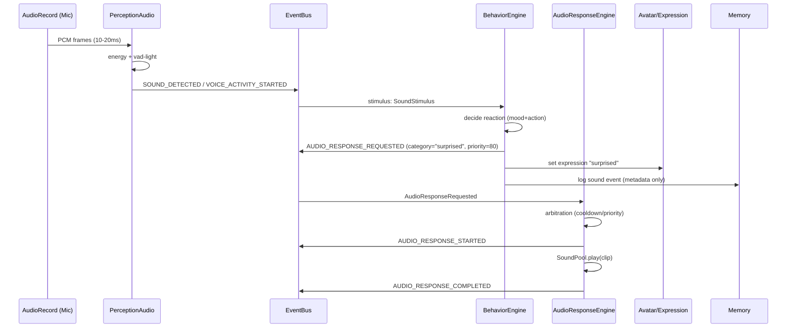
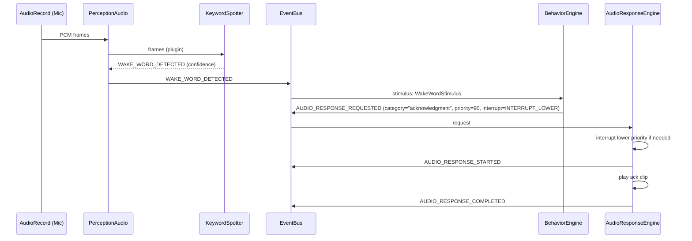
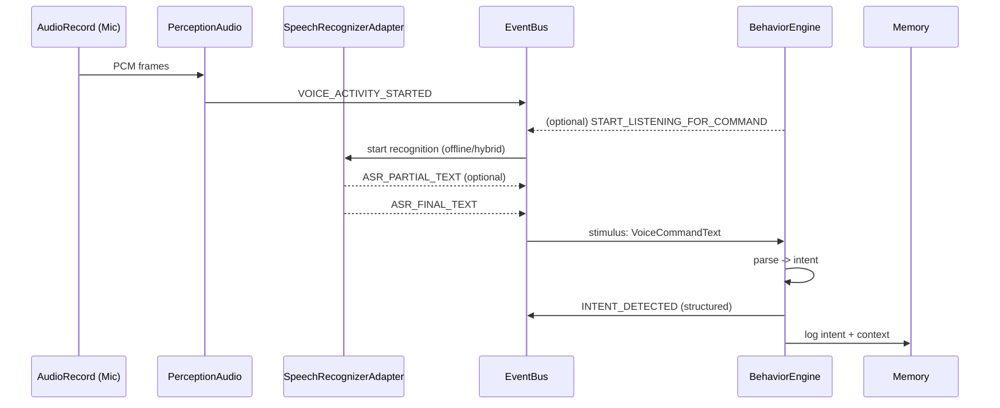

# Kiến trúc Tương tác Âm thanh cho AI Pet Robot

*Tài liệu mục tiêu: `docs/08_audio_interaction_architecture.md` (mở rộng kiến trúc hiện tại bằng một lớp Audio Interaction, nằm giữa Phase 1 và Phase 2).*

## Mục đích, phạm vi và mô hình năng lực

**1) Purpose and Scope — Vì sao tài liệu này tồn tại và giải quyết vấn đề gì**

Âm thanh là “kênh sinh học” giúp robot thú cưng tạo cảm giác *đang sống*: nó nghe được môi trường (có tiếng động, có giọng người), phản ứng tức thì bằng biểu cảm/động tác/âm thanh ngắn, trước khi bước vào AI hội thoại phức tạp. Ở Phase 1 thuần hành vi–avatar, pet dễ rơi vào trạng thái “đẹp nhưng câm/đơ”. Thêm Audio Interaction ở giai đoạn chuyển tiếp giúp:

- Tăng *responsiveness* (phản xạ kiểu thú cưng) bằng tín hiệu âm thanh đơn giản, không cần hiểu ngôn ngữ.
- Tạo “đường ray” kiến trúc cho wake word / keyword / ASR / TTS sau này mà không phải đập đi làm lại.
- Giữ đúng ràng buộc: **offline-first**, **event-driven**, **modular**, **behavior engine là nơi ra quyết định**.

**Ranh giới quan trọng của tài liệu này**

- **Không** triển khai hội thoại đầy đủ, không “cloud-first voice”.
- MVP ưu tiên **nghe & phản ứng** + **phát clip ghi sẵn** (pre-recorded) như một “ngôn ngữ” âm thanh của pet.
- Các lớp wake word/ASR/TTS chỉ được thiết kế **extension points** + roadmap.

**4) Audio Interaction Capability Model — Các mức năng lực**

| Level | Tên | Mô tả năng lực | Ví dụ trải nghiệm |
|---|---|---|---|
| 0 | Silent pet | Không nghe, không phản ứng âm thanh | Chỉ phản ứng theo UI/sensor khác |
| 1 | Sound-reactive pet | Nghe năng lượng âm thanh + “voice-activity light” (VAD nhẹ) → phát sự kiện | Có tiếng động → nhìn sang / giật mình / “chíp” |
| 2 | Keyword-reactive pet | Wake word / keyword spotting đơn giản → sự kiện semantic | “bé ơi” → quay lại + “ừm?” |
| 3 | Command-reactive pet | ASR → parse câu lệnh → intent event | “ngồi xuống” → thực hiện |
| 4 | Conversational pet | ASR + TTS + LLM + memory-aware speech + orchestration | Nói chuyện đa lượt, nhớ ngữ cảnh |

**3) Design Principles — Nguyên tắc thiết kế bắt buộc**

- **Offline-first cho Stage A**: mọi thứ (capture → detect → event → phản ứng clip) chạy được khi không có mạng.
- **Event-driven**: Perception phát *events*, Behavior Engine chọn *actions*; Audio chỉ là một kênh perception + kênh actuation (playback) theo sự kiện.
- **Modular, thay thế được**: VAD/wake word/ASR là plugin/adapter, không cắm chặt vào “brain core”.
- **Small, verifiable increments**: Stage A phải test/đo được (latency, false trigger, CPU).
- **Low latency, pet-like**: phản ứng “đủ nhanh” quan trọng hơn “thông minh”. Với audio MVP, mục tiêu là phản xạ < ~200–300ms sau khi phát hiện tiếng động (tùy thiết bị).
- **Privacy-conscious**: mặc định *không lưu raw audio*, chỉ lưu đặc trưng & sự kiện; UI phải làm người dùng tin.

**5) Recommended MVP Scope — Cái gì làm ngay vs để sau**

**Stage A (Audio Reaction MVP) — Làm ngay**
- Audio input capture bằng **AudioRecord** (raw PCM) để vừa đo năng lượng vừa mở đường cho pipeline trên-device. citeturn0search8turn0search5  
- Detector “VAD-light”:
  - RMS/energy + smoothing + hysteresis (ngưỡng bật/tắt khác nhau)  
  - “hangover time” (giữ trạng thái *voice active* thêm vài trăm ms) để tránh nhấp nháy event
- Event emission: SOUND_DETECTED / VOICE_ACTIVITY_STARTED/ENDED, v.v.
- Playback: **SoundPool** cho clip ngắn “pet responses”, pre-load vào RAM, có priority & limit streams. citeturn0search0  
- Arbitration tối thiểu: chống chồng clip + cooldown + ưu tiên (warning > ack > ambient).
- Tích hợp Behavior loop: Behavior Engine phản ứng dựa trên events; Avatar/mood/memory update ở mức “logging sự kiện + biểu cảm”.

**Stage B (Wake Word / Keyword Layer) — Chuẩn bị extension, chưa bắt buộc**
- Cắm thêm `KeywordSpotter` interface:
  - Phương án thực dụng: Porcupine (Picovoice) chạy on-device, có SDK đa nền tảng, repo Apache-2.0, nhưng cần AccessKey/Console ở nhiều flow. citeturn9search0turn9search1  
  - Phương án open-source training: TFLite keyword spotting (tự train / fine-tune) — tốn công pipeline dữ liệu. citeturn2search0turn8search4  
  - Không dựa vào Always-on hotword API hệ thống cho app thường (rủi ro/giới hạn hệ sinh thái, và có lịch sử thay đổi API + quyền hệ thống). citeturn3search3turn4search5turn4search9  

**Stage C (Voice Command / Intent Layer) — Để sau MVP**
- ASR:
  - `SpeechRecognizer` thuận tiện nhưng API cảnh báo có thể stream audio lên server và không dành cho continuous recognition (pin/bandwidth). citeturn0search11turn3search15  
  - Vosk: offline, streaming API, có Vietnamese/English, model nhỏ ~50MB nhưng vẫn là gánh nặng dung lượng/CPU trên mobile; cần NDK/packaging tốt. citeturn2search5  
- Command parsing → Intent events.

**Stage D (Conversational Voice Layer) — Không thuộc tài liệu MVP**
- TTS: dùng `TextToSpeech` sau, không dùng ở MVP để tránh “robot nói như trợ lý” khi pet chưa có pipeline thoại. `TextToSpeech` vẫn là đường chuẩn cho sau vì API hệ thống, có quản lý engine/voices. citeturn0search9  
- Cloud/local LLM, memory-aware speech, audio orchestration nâng cao.

**18) Non-goals / Explicitly Deferred — Cố tình không giải trong tài liệu này**
- Luồng hội thoại đa lượt, streaming ASR/TTS end-to-end, “barge-in” toàn diện.
- Cloud wake-word/hotword.
- Lưu trữ/đồng bộ raw audio (mặc định không lưu).
- DSP/firmware hotword trên MCU.
- Chẩn đoán âm học nâng cao (AEC/NS/beamforming chuyên nghiệp).

## Vị trí trong kiến trúc hiện tại và module đề xuất

**2) Position in the Existing Project Architecture — Audio nằm ở đâu**

Tài liệu này giả định kiến trúc hiện tại có các khối:
- **Android phone = Main Brain**: nơi chạy perception/behavior/avatar/memory orchestration.
- **Behavior Engine**: nơi ra quyết định hành vi (không để audio “tự quyết”).
- **Avatar/Expression**: biểu cảm trên UI/renderer.
- **Memory System**: ghi lại sự kiện & trạng thái (không nhất thiết lưu raw input).
- **MCU/robot body**: chấp hành chuyển động/đèn/servo dựa trên command.

**Audio Interaction layer** sẽ là:
- Một **Perception sub-layer (Audio Perception)**: đọc mic → trích đặc trưng → phát events.
- Một **Actuation sub-layer (Audio Response Playback)**: phát clip phản hồi theo yêu cầu từ Behavior.

Luồng “đúng kiến trúc”:
1) Audio Perception **phát sự kiện** →  
2) Behavior Engine **chọn phản ứng** (mood + animation + movement + audio response request) →  
3) Audio Response Engine **thực thi phát clip** + emit events (started/completed/skipped).

**7) Proposed Modules and Responsibilities — Module hóa cụ thể**

Đề xuất bổ sung (tên module chỉ là gợi ý; quan trọng là ranh giới):

**Module `perception-audio`**
- Trách nhiệm:
  - Quản lý capture mic (AudioRecord lifecycle, foreground service nếu cần).
  - Pipeline detector (energy/VAD-light, sau này cắm thêm keyword/ASR).
  - Chuẩn hóa feature frames & sự kiện âm thanh.
  - “Playback-aware gating” để tránh pet tự nghe chính tiếng của nó (xem phần Playback Policy).
- Không làm:
  - Không quyết định hành vi.
  - Không phát audio phản hồi.

**Module `audio-response`**
- Trách nhiệm:
  - Quản lý asset clip (preload, mapping category → clips, random hóa).
  - Thực thi playback (SoundPool cho MVP).
  - Arbitration: ưu tiên, cooldown, chặn overlap, queue tối thiểu.
  - Emit playback events (started/completed/skipped).
- Không làm:
  - Không quyết định khi nào nên phát (Behavior đặt request).

**Module tích hợp trong “brain/app core” (không tách thành module lớn mới)**
- `audio-interaction-domain` (hoặc một lớp integration):
  - Đóng vai trò *adapter* giữa event bus của hệ thống và 2 module audio.
  - Ánh xạ events → Behavior stimuli, và actions → `AUDIO_RESPONSE_REQUESTED`.

**Thay đổi tối thiểu gợi ý cho các module hiện hữu**
- Behavior Engine:
  - Thêm ruleset cho audio stimuli (loud sound → surprised…).
- Avatar:
  - Thêm vài animation hooks đồng bộ với audio response events.
- Memory:
  - Lưu “sound events” dạng metadata (timestamp, energy, label), không lưu raw PCM.

## Kiến trúc Android Audio Interaction

**6) Android Audio Architecture — Thiết kế Android-side cụ thể**

### Audio input capture (MVP)

**Khuyến nghị dùng `AudioRecord` cho Stage A** vì:
- Đọc được PCM theo chunk để tính energy/VAD và tái sử dụng pipeline cho keyword/ASR. citeturn0search8turn0search5  
- `MediaRecorder` phù hợp hơn khi mục tiêu là *ghi file/encode* (AAC/OPUS…) thay vì “nhận dạng & phản xạ realtime”. citeturn1search0turn1search2  

**Thiết lập thực dụng (đủ tốt cho pet phản xạ)**
- Mono, PCM 16-bit.
- Sample rate: ưu tiên 16kHz (voice-friendly, nhẹ CPU) nhưng phải chấp nhận thiết bị khác nhau; `AudioRecord` cho biết 44100Hz là mức “đảm bảo” trên mọi thiết bị, còn 16000/22050 có thể không phải nơi nào cũng hỗ trợ. citeturn0search8  
- Buffer: dùng `getMinBufferSize` + nhân 2–4 để giảm overrun, rồi đọc theo frame nhỏ (10–30ms) để detector ổn định.

**Quyền & vòng đời capture**
- `RECORD_AUDIO` là dangerous permission, cần runtime grant. citeturn5search4  
- Android hạn chế mic khi app ở background; cần chạy foreground hoặc foreground service (FGS). Với Android 14+ cần khai báo đúng foreground service type; với microphone cần type `microphone` + permission tương ứng + runtime `RECORD_AUDIO`. citeturn1search0turn1search1turn1search4turn1search12  

### Detector pipeline (VAD-light trước, extensible sau)

**MVP pipeline (Level 1)**
1) `AudioFrameSource`: đọc PCM → frame 10–20ms.
2) `EnergyEstimator`: RMS/peak → dBFS tương đối.
3) `Smoothing + Hysteresis`: lọc nhiễu, tránh spam events.
4) `VADLightStateMachine`:
   - Transition: SILENT → SOUND_PRESENT → VOICE_LIKELY (tùy ngưỡng).
   - Hangover: giữ VOICE_LIKELY thêm N ms sau khi energy rớt ngưỡng.
5) `EventEmitter`: bắn events lên event bus (xem Event Model).

**Extension points**
- `VoiceActivityDetector` (plugin):
  - Option 1: WebRTC VAD (nhẹ, realtime, làm việc trên frame 10/20/30ms, 16-bit mono PCM; có chế độ aggressiveness). citeturn2search2turn2search17  
  - Option 2: vẫn giữ energy-based cho MVP để đơn giản, rồi thay bằng WebRTC VAD khi cần “voice vs noise” tốt hơn.
- `KeywordSpotter` (Stage B): Porcupine / TFLite KWS.
- `SpeechRecognizerAdapter` (Stage C): Vosk / SpeechRecognizer.

### Response playback engine (MVP)

**Khuyến nghị MVP dùng `SoundPool`**
- SoundPool pre-decode audio vào PCM, phù hợp clip ngắn low-latency. citeturn0search0  
- Có cơ chế `maxStreams` và ưu tiên: vượt quá giới hạn stream thì SoundPool tự dừng stream thấp priority hơn/già hơn; nếu stream mới priority thấp hơn tất cả stream đang chạy thì sẽ không phát (`play()` trả 0). citeturn0search0  
- Có giới hạn nội bộ: mỗi sound decode bị giới hạn ~1MB (tương đương vài giây tùy sample rate/channel). Điều này “tình cờ” ép đúng tinh thần pet clip ngắn. citeturn0search0  

**Khi nào dùng `MediaPlayer` / ExoPlayer**
- `MediaPlayer`: đơn giản nhưng không thread-safe, lifecycle dễ lỗi khi dùng nhiều clip ngắn; không tối ưu cho “sound effects”. citeturn0search6  
- ExoPlayer (Media3): mạnh cho media dài/streaming, playlist, buffering; được Android khuyến nghị cho playback app; nhưng cho Stage A sẽ overkill. citeturn5search6turn5search5  

### State & Orchestration (Audio Orchestrator)

Thêm một lớp điều phối nhỏ (trong `audio-response` hoặc integration layer) để:
- Chỉ cho phép **1 kênh “pet voice”** phát tại một thời điểm (tránh “nói chồng” với chính mình).
- Gắn playback với avatar animation (start/completed).
- Gate microphone detector khi pet đang phát clip (*self-trigger suppression*).

### Debugging hooks

MVP cần hook để “build nhanh – đo nhanh”:
- Overlay/Dev panel: hiển thị energy bar, trạng thái VAD, last event, last clip.
- Log structured: event timeline (timestamp, energy, thresholds, triggered rule).
- Optional: ghi PCM ngắn *chỉ trong dev build* để debug false triggers (mặc định off vì privacy).

## Mở rộng Event Model và tích hợp vào Behavior Loop

**8) Event Model Extensions — Các event mới và payload đề xuất**

Các event dưới đây nên là *hợp đồng* (contract) giữa perception–behavior–audio-response. Payload đề xuất tối thiểu:

- `SOUND_ENERGY_CHANGED`
  - Payload: `{ timestamp, rmsDb, peakDb, smoothedDb, source="MIC", sessionId }`
  - Lý do: Avatar/mood có thể dùng energy liên tục (ví dụ “nhìn quanh khi có tiếng động nhẹ”).

- `SOUND_DETECTED`
  - Payload: `{ timestamp, energyDb, confidence, kind="UNKNOWN|NOISE|VOICE_LIKELY", durationMs? }`
  - Lý do: Behavior rule “đủ điều kiện” khi có tiếng rõ.

- `VOICE_ACTIVITY_STARTED` / `VOICE_ACTIVITY_ENDED`
  - Payload: `{ timestamp, energyDb, vadMode="energy|webrtc", confidence }`

- `WAKE_WORD_DETECTED` (Stage B)
  - Payload: `{ timestamp, keywordId, keywordText?, confidence, engine="porcupine|tflite|pocketsphinx" }`

- `KEYWORD_DETECTED` (Stage B/C)
  - Payload: `{ timestamp, keywordId, slots?, confidence }`

- `AUDIO_RESPONSE_REQUESTED`
  - Payload: `{ timestamp, category, clipId? , priority, interruptPolicy, cooldownKey, context (mood, lastEventIds) }`

- `AUDIO_RESPONSE_STARTED` / `AUDIO_RESPONSE_COMPLETED` / `AUDIO_RESPONSE_SKIPPED`
  - Payload: `{ timestamp, category, clipId, reason? , durationMs, priority }`

**Tại sao payload cần “priority/interruptPolicy/cooldownKey”**  
Vì chính sách phát là nơi dễ phát sinh hành vi “khó chịu” nhất (spam, nói chồng, cắt ngang sai). Nếu payload rõ, AudioResponseEngine có thể làm đúng vai trò: *thực thi chính sách* nhưng không giành quyền quyết định của Behavior.

**9) Behavior Integration — Audio ảnh hưởng mood / emotion / avatar / movement / memory như thế nào**

Đề xuất cách tích hợp “đúng event-driven”:

1) **Audio events → Stimuli**: Behavior Engine nhận stimuli `SoundStimulus` (từ event) kèm intensity.
2) **Personality/Mood modulation**: cùng một tiếng động nhưng pet “nhút nhát” vs “tò mò” phản ứng khác.
3) **Decision**: Behavior tạo `ActionPlan` gồm:
   - Avatar expression (ngạc nhiên/để ý…)
   - Movement (quay đầu, nghiêng…)
   - Audio response request (clip category)
   - Memory log policy (log event/không log)

**Ví dụ rule (cụ thể, buildable)**
- Nếu `SOUND_DETECTED` với `energyDb` vượt “loudThreshold” và trong 2s gần đây pet không phát clip:
  - Emotion: `SURPRISED` tăng nhanh, decay 3–5s.
  - Avatar: animation “startle”.
  - Movement: “look_toward_sound” (nếu có model hướng; nếu chưa có thì random slight turn).
  - Audio: request category `surprised` priority=80 cooldownKey=`surprised_short`.

- Nếu `VOICE_ACTIVITY_STARTED` và pet đang ở state “idle/curious”:
  - Mood/attention: tăng.
  - Avatar: “attentive”.
  - Audio: *không phát ngay* (tránh spam). Chỉ phát `acknowledgment` nếu voice kéo dài > X ms hoặc có wake word sau này.

- Stage B: Nếu `WAKE_WORD_DETECTED`:
  - Emotion: curious + happy nhẹ.
  - Audio: request `acknowledgment` priority=90 interruptPolicy=`INTERRUPT_LOWER`.
  - Memory: ghi lại “owner called pet” (không lưu raw audio).

## Hệ thống Audio Response, arbitration và chiến lược asset

**10) Audio Response System — Thiết kế clip ghi sẵn**

### Mục tiêu thiết kế
- Clip ngắn, “thú cưng”, phản xạ nhanh.
- Là “first-class citizen” trong MVP (không coi là tạm bợ).
- Có random hóa trong category để tránh nhàm.
- Có cooldown/anti-spam.
- Không overlap lung tung; có ưu tiên.

### Danh mục clip đề xuất (MVP)
- `greeting`
- `curious`
- `happy`
- `sleepy`
- `acknowledgment`
- `surprised`
- `warning_no`

### Naming convention (đề xuất thực dụng)
- `pet_<category>_<variant>_<lenMs>.ogg`  
  Ví dụ: `pet_ack_02_420.ogg`, `pet_surprised_01_350.ogg`

### Randomization within category
- `category` map → list clipIds + weight.
- Chọn ngẫu nhiên có trọng số, tránh lặp lại cùng clip trong N lần gần nhất.

### Cooldown / anti-spam (cực quan trọng)
- Cooldown theo `cooldownKey` (thường trùng category):
  - `ack`: 2–4s
  - `surprised`: 3–6s
  - `warning_no`: 1–2s nhưng max 2 lần/10s
- Anti-spam theo “event storm”: nếu energy events quá dày, chỉ dùng `SOUND_ENERGY_CHANGED` cho avatar, không phát clip.

**11) Playback Policy and Arbitration — Khi xung đột xảy ra, làm gì**

AudioResponseEngine nên có policy rõ ràng, độc lập với UI:

### Priority model (0–100)
- 90–100: `warning_no`, `acknowledgment` sau wake word
- 70–89: `surprised`
- 40–69: `greeting`, `curious`, `happy`
- 0–39: `sleepy`, ambient

### Interrupt policy
- `INTERRUPT_ANY`: cắt mọi thứ (chỉ dùng cho safety)
- `INTERRUPT_LOWER`: chỉ cắt nếu đang phát clip priority thấp hơn
- `QUEUE`: xếp hàng (giới hạn queue=1 để tránh backlog)
- `SKIP_IF_BUSY`: bận thì bỏ qua

**Cơ chế thực thi với SoundPool**
- SoundPool có “priority” trong `play()` và cơ chế tự dừng stream khi vượt `maxStreams`. citeturn0search0  
- Tuy nhiên, **không nên** dựa hoàn toàn vào SoundPool để quyết định hành vi; AudioResponseEngine vẫn phải:
  - Track “currentPlaying” + priority
  - Quyết định stop/skip/queue theo policy, rồi mới gọi SoundPool.

### Khi avatar animation đang transition
- Không block audio vì avatar; thay vào đó:
  - Nếu clip priority cao: phát ngay, avatar “snap” sang state phù hợp.
  - Nếu clip priority thấp: có thể delay 100–200ms để avatar chuyển mượt.
- Quyết định delay thuộc Behavior (để giữ “behavior engine decides”), nhưng AudioResponseEngine có thể hỗ trợ `earliestStartMs`.

### Khi robot movement đang xảy ra
- Nếu movement là “active personality action” (nhảy/vẫy mạnh): ưu tiên movement; audio clip chỉ phát nếu category phù hợp (happy) và không gây “lố”.
- Nếu movement là “turn head”: audio vẫn phát bình thường.

### Khi tương lai có TTS
- TTS sẽ là một “channel” khác (`speechChannel`) và cần arbitration cao hơn clip:
  - TTS nói → clip category thấp phải bị chặn/duck.
  - Clip warning có thể “barge-in” nếu safety.
- Gợi ý sớm: thiết kế `AudioChannel` enum ngay từ Stage A: `PET_CLIP`, `TTS`, `SYSTEM`.

### Khi tương lai có cloud response đến trễ
- Cloud response (Stage D) phải gắn `requestId`/`deadlineMs`.
- Nếu quá deadline hoặc pet state đã đổi → bỏ qua, tránh “nói lạc đề”.

**12) Data / Asset Strategy — File audio nằm ở đâu, metadata ra sao**

### Nơi lưu clip
- MVP: ship clip trong APK/AAB (`res/raw` hoặc `assets/`).
  - SoundPool hỗ trợ load từ resource/asset và decode qua MediaCodec để tránh decompress lúc phát. citeturn0search0  
- Không khuyến nghị MVP tải clip từ mạng (vi phạm offline-first & tăng complexity cache/integrity).

### Format khuyến nghị
- Ưu tiên `.ogg (Vorbis)` hoặc `.wav`/`.mp3` theo mức tiện/độ tương thích, nhưng nên test trên thiết bị thật vì codec có thể khác nhau theo máy. Android có tài liệu liệt kê “supported media formats” và lưu ý thiết bị có thể hỗ trợ thêm/khác. citeturn10search10  
- Nếu sau này dùng ExoPlayer cho audio dài, ExoPlayer hỗ trợ Ogg container chứa Vorbis/Opus/FLAC, WAV, MP3… citeturn10search5  

### Manifest metadata (đề xuất đơn giản, không overengineer)
Một file JSON nhỏ trong assets: `audio_clips_manifest.json`

Ví dụ schema (gợi ý):
```json
{
  "version": 1,
  "categories": {
    "acknowledgment": {
      "cooldownMs": 2500,
      "priority": 90,
      "clips": [
        {"id": "pet_ack_01_380", "path": "audio/pet_ack_01_380.ogg", "weight": 1.0},
        {"id": "pet_ack_02_420", "path": "audio/pet_ack_02_420.ogg", "weight": 1.0}
      ]
    }
  }
}
```

## Rủi ro về quyền riêng tư, pin, hiệu năng và so sánh công nghệ

**13) Privacy, Safety, Battery, and Performance — Rủi ro & cách giảm**

### Quyền riêng tư & niềm tin người dùng
- Mic usage luôn nhạy cảm; Android có privacy indicators (Android 12 trở lên) hiển thị lúc app dùng mic/camera và cho người dùng xem app nào dùng trong ~15 giây gần nhất. citeturn5search3  
- `RECORD_AUDIO` là dangerous permission; phải có UX giải thích rõ “robot nghe để phản ứng, không gửi lên mạng ở MVP”. citeturn5search4turn5search7  
- Khuyến nghị MVP:
  - Không lưu raw audio.
  - Có toggle “Audio listening” + indicator trong app.
  - Log memory chỉ lưu sự kiện mức cao (voice started/ended, energy peak).

### Background listening & giới hạn hệ thống
- Android hạn chế mic khi app background; cần foreground UI hoặc foreground service. MediaRecorder docs nêu rõ từ Android 9 apps chạy nền không truy cập mic; cần foreground service để record. citeturn1search0  
- Android 11+ yêu cầu khai báo foreground service types cho mic. citeturn1search4turn1search3  
- Android 14/15 siết tiếp: nếu target Android 15 (API 35) trở lên, app không được request audio focus nếu không là top app hoặc không chạy foreground service. Điều này ảnh hưởng cả playback policy khi pet phát âm thanh lúc background. citeturn5search2  

### Pin/CPU/thermal
- Capture + xử lý frame 10–20ms liên tục sẽ giữ CPU thức; vì vậy Stage A nên:
  - Chỉ chạy khi pet “active session” (màn hình đang mở hoặc user bật chế độ).
  - Detector energy-based trước (rất rẻ) rồi mới nâng lên WebRTC VAD / KWS.
- Thêm “duty cycling” tùy tình huống: nếu yên tĩnh lâu → giảm tần suất emit events.

### Latency
- Latency của playback: SoundPool hướng tới low-latency; các clip cần preload trước. citeturn0search0  
- Latency toàn tuyến (detect→react) chủ yếu nằm ở:
  - Buffer size & frame size của AudioRecord
  - Smoothing window của detector
- Mục tiêu MVP thực dụng: phản xạ “nhìn/biểu cảm” < 200–300ms, phát “ack clip” < 400ms sau trigger (tùy device).

**14) Technology Options Comparison — So sánh có khuyến nghị theo stage**

### Audio capture: AudioRecord vs MediaRecorder
- `AudioRecord`:
  - Ưu: đọc PCM realtime, phù hợp detect/VAD/KWS/ASR pipeline; builder cho phép set format/source/buffer. citeturn0search8turn0search5  
  - Nhược: tự quản buffer/polling; cần thread/coroutine xử lý ổn.
  - Khuyến nghị: **MVP chọn AudioRecord**.
- `MediaRecorder`:
  - Ưu: tiện ghi file/encode; phù hợp khi mục tiêu là lưu audio. citeturn1search0turn1search2  
  - Nhược: không tiện để làm detector realtime; pipeline phân tích sẽ khó hơn.
  - Khuyến nghị: chỉ dùng nếu Stage C/D cần “record utterance” để debug/feedback có chủ đích.

### VAD-light: energy threshold vs WebRTC VAD
- Energy threshold:
  - Ưu: cực đơn giản, rẻ CPU, phù hợp Stage A.
  - Nhược: dễ false positive (quạt/nhạc/tiếng xe) và khó phân biệt “voice” thật.
  - Khuyến nghị: **Stage A dùng energy-based + hysteresis/hangover**.
- WebRTC VAD:
  - Ưu: làm việc trên PCM 16-bit mono, frame 10/20/30ms, có chế độ aggressiveness; thực dụng để nâng chất lượng “voice presence”. citeturn2search2turn2search17  
  - Nhược: cần native binding/NDK hoặc wrapper; vẫn chỉ là VAD, không hiểu nội dung.
  - Khuyến nghị: **Stage A.2 / Stage B chuẩn bị** (sau khi MVP chạy ổn).

### Wake word / keyword spotting: built-in Android vs SDK/open-source
- Built-in hotword (VoiceInteractionService / AlwaysOnHotwordDetector):
  - Bản chất gắn với vai trò “assistant mặc định”, hệ thống giữ service luôn chạy để nghe hotword. citeturn3search7turn3search6  
  - Có các permission/system API như `MANAGE_HOTWORD_DETECTION` (internal/preinstalled), khó hoặc không phù hợp cho app thường/hobby. citeturn4search5  
  - Có lịch sử thay đổi surface API (package `android.service.voice` từng “Removed Classes” trong API diff level 31). citeturn4search9  
  - Kết luận: **không chọn** cho dự án pet app thông thường.
- Porcupine (Picovoice):
  - On-device wake word, repo Apache-2.0, chạy đa nền tảng; có hỗ trợ Android. citeturn9search0turn9search1  
  - Tradeoff: thường cần AccessKey/Console flow; phụ thuộc SDK bên thứ ba.
  - Khuyến nghị: **Stage B nếu muốn nhanh & chất lượng tốt**.
- TensorFlow Lite KWS:
  - Có ví dụ micro-speech model nhỏ (~20KB) nhận 2 keyword; có hướng train lại. citeturn2search0turn8search4  
  - Tradeoff: bạn phải làm data/training/mô hình hóa keyword tiếng Việt; công lớn hơn.
  - Khuyến nghị: **Stage B nếu muốn open pipeline & kiểm soát**.
- Snowboy:
  - Dự án chính thức ngừng/đóng dịch vụ từ 31/12/2020; chỉ còn community support. citeturn10search0  
  - Khuyến nghị: **không dùng**.
- PocketSphinx:
  - Có hướng dẫn Android demo, hỗ trợ keyword spotting/list; nhưng cần model và pipeline ngôn ngữ–âm học; tiếng Việt khó hơn. citeturn10search18turn10search12  
  - Khuyến nghị: chỉ cân nhắc nếu bạn muốn keyword spotting kiểu grammar offline đơn giản và chấp nhận effort model.

### Offline / hybrid ASR: SpeechRecognizer vs Vosk
- `SpeechRecognizer`:
  - Ưu: built-in, không thêm lib; có entrypoint `createOnDeviceSpeechRecognizer`.
  - Nhược: tài liệu API cảnh báo implementation “likely to stream audio to remote servers” và không intended cho continuous recognition (pin/bandwidth). citeturn0search11turn3search15  
  - Khuyến nghị: **Stage C (hybrid)** cho command ngắn, không chạy liên tục; cần UX rõ ràng vì privacy.
- Vosk:
  - Offline open-source, có Vietnamese/English; model ~50MB, streaming API. citeturn2search5  
  - Tradeoff: dung lượng/memory/CPU; packaging model; cần benchmark trên thiết bị mục tiêu.
  - Khuyến nghị: **Stage C (offline-first) nếu bạn chấp nhận tăng kích thước app**.

### Playback: SoundPool vs MediaPlayer vs ExoPlayer
- MVP: **SoundPool** cho clip ngắn (pet responses) vì low-latency và quản lý stream/priority. citeturn0search0  
- Stage D hoặc audio dài: cân nhắc **ExoPlayer (Media3)**; Android khuyến nghị cho app playback vì feature đầy đủ và giảm fragmentation. citeturn5search6turn5search5  
- `MediaPlayer`: chỉ dùng nếu bạn phát file dài rất đơn giản; lưu ý không thread-safe. citeturn0search6  

**15) Recommended Architecture Decision — Chốt lựa chọn cho dự án này**

**Chọn ngay (Stage A)**
- Capture: AudioRecord (PCM 16-bit mono). citeturn0search8turn0search5  
- Detection: energy-based VAD-light + hysteresis/hangover (đơn giản, rẻ, đủ làm pet “sống”).  
- Playback: SoundPool + clip manifest + arbitration rõ (priority/cooldown/skip/interrupt). citeturn0search0  
- Foreground service strategy: chỉ bật listening khi user “Activate pet”; nếu cần background mic thì khai báo FGS microphone đúng chuẩn. citeturn1search1turn1search4turn1search3  

**Postpone (để đúng tinh thần “không nhảy cóc”)**
- Wake word luôn-on kiểu hệ thống (assistant APIs).
- ASR/TTS/LLM hội thoại.

**Giữ đường mở rộng**
- Interface plugin: `VoiceActivityDetector`, `KeywordSpotter`, `SpeechRecognizerAdapter`, `SpeechSynthesizer`.
- Event contract & payload ngay từ Stage A để Stage B/C/D không phá kiến trúc.

## Sequence diagrams và lộ trình triển khai

**16) Sequence Diagrams — Mermaid**

### Sound detected → behavior → clip playback (Stage A)


### Wake word detected → acknowledgment (Stage B)


### Future voice command flow (Stage C)


**17) Implementation Roadmap — Stage A–D theo thứ tự build được**

### Stage A — Audio Reaction MVP (đúng mục tiêu “sống trước, thông minh sau”)
1) **PerceptionAudio skeleton**
   - AudioRecord capture loop + cấu hình tối thiểu. citeturn0search8turn0search5  
   - Đảm bảo permission `RECORD_AUDIO` + UX giải thích. citeturn5search4  
2) **Energy estimator + VAD-light**
   - Smoothing, hysteresis, hangover
   - Emit `SOUND_ENERGY_CHANGED`, `SOUND_DETECTED`, `VOICE_ACTIVITY_STARTED/ENDED`
3) **AudioResponseEngine v1**
   - SoundPool preload clips, manifest mapping, play/stop, emit events. citeturn0search0  
4) **Arbitration v1**
   - Single channel, cooldown, interrupt lower, skip if busy
5) **Behavior integration v1**
   - 3–5 rules tối thiểu (loud→surprised, voice→attentive, quiet long→sleepy)
6) **Avatar hooks**
   - Đồng bộ animation với audio-response started/completed
7) **Memory logging v1**
   - Lưu metadata events (không raw audio)

### Stage B — Wake Word / Keyword Layer
1) Chọn engine (khuyến nghị thực dụng: Porcupine) và đóng sau `KeywordSpotter` interface. citeturn9search0  
2) Emit `WAKE_WORD_DETECTED`, map → Behavior rule → `ack` clip.
3) Tuning false accept/false reject + self-trigger suppression khi pet phát clip.

### Stage C — Voice Command / Intent Layer
1) PoC 2 nhánh:
   - Vosk offline (VN+EN) benchmark CPU/memory/app size. citeturn2search5  
   - SpeechRecognizer hybrid (không continuous), UX xin phép & disclosure. citeturn3search15turn0search11  
2) Intent parser (rule-based trước), emit `INTENT_DETECTED`.
3) Memory logging: store intent + outcome.

### Stage D — Conversational Voice Layer
1) TTS integration (`TextToSpeech`) + speech channel arbitration. citeturn0search9  
2) Cloud/local LLM orchestration, memory-aware responses.
3) Advanced audio focus + barge-in.

**19) Final Recommendation — Khuyến nghị thực dụng cho dự án này**

Nếu mục tiêu là *AI Pet Robot cảm giác sống* trong thời gian ngắn và vẫn giữ “đường lên” Stage B/C/D sạch:

- **Chốt Stage A với AudioRecord + VAD-light energy + SoundPool** (đừng nhảy sang ASR/TTS sớm). Lý do: ít phụ thuộc, ít rủi ro privacy, đo–tối ưu được nhanh, và vẫn giữ được extension points. citeturn0search8turn0search0  
- **Thiết kế event contract ngay từ đầu** (có priority/cooldown/interruptPolicy) để khi thêm wake word/ASR không phá Behavior.  
- **Đừng dùng hotword API kiểu assistant của Android** cho hobby pet app: vừa lệ thuộc role hệ thống, vừa có rủi ro quyền/compat. citeturn3search6turn4search5turn4search9  
- **Stage B nên ưu tiên Porcupine** nếu bạn muốn “có wake word nhanh và chạy on-device” mà không tự làm ML pipeline; còn nếu bạn muốn kiểm soát và chấp nhận công train, hãy đi hướng TFLite KWS. citeturn9search0turn2search0  
- **Stage C nên song song benchmark Vosk vs SpeechRecognizer** và chọn theo ràng buộc app size + privacy + độ ổn định thiết bị. citeturn2search5turn3search15  

## Suggested next documents or follow-up tasks

- Cập nhật tài liệu kiến trúc tổng (`docs/05_full_system_architecture.md`) để thêm lớp **Audio Interaction** như một Perception+Actuation extension, mô tả event flow và module boundaries.
- Cập nhật roadmap (`docs/development_roadmap.md`) để thêm Stage A/B/C/D với milestone rõ “xong khi đo được latency/false triggers”.
- Tạo một tài liệu nhỏ “Audio Events Contract” (hoặc append vào doc event bus hiện hữu) mô tả payload và versioning.
- Backlog đề xuất (có thể tách task):
  - Implement `perception-audio` AudioRecord capture + energy estimator + VAD-light
  - Implement `audio-response` SoundPool preload + manifest + arbitration
  - Add Behavior rules + avatar hooks cho 5–7 phản xạ đầu tiên
  - Add dev debug panel (energy/VAD state/event timeline)
  - Add privacy UX: disclosure + toggle + indicator + permission flows
  - Benchmark profiles: CPU, battery drain, latency on 2–3 thiết bị Android khác nhau