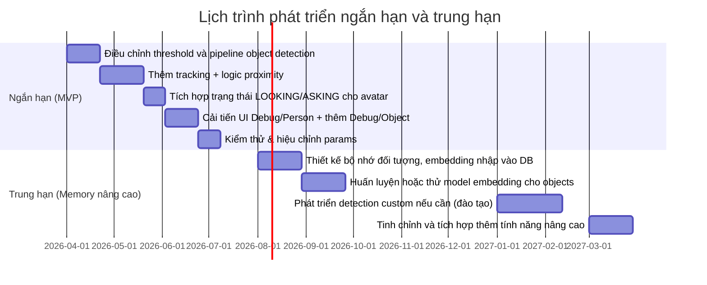

# Báo cáo nghiên cứu: Cải thiện nhận dạng đối tượng gần khuôn mặt cho pet AI trên Android

**Tóm tắt:** Để pet AI có thể phát hiện và ghi nhớ các đồ vật xuất hiện gần một người trong môi trường thực tế, cần cập nhật toàn diện pipeline thị giác. Hiện tại pet đã nhận diện khuôn mặt hiệu quả (thường dùng MediaPipe Face Detector) nhưng nhận dạng đồ vật còn yếu, thiếu theo dõi (tracking) và bộ nhớ đối tượng. Bài báo cáo này phân tích các thư viện hiện tại (MediaPipe, ML Kit, các mô hình TFLite như YOLO/EfficientDet), so sánh các giải pháp (MediaPipe Task, ML Kit, YOLO, segmentation, Vision-Language Models) và đề xuất kiến trúc thực thi ngắn hạn và trung hạn. Kết quả chính là một pipeline kết hợp **object detection + tracking + logic không gian (proximity)**, ngưỡng tin cậy cao hơn, bộ nhớ vật thể tùy chọn và giao diện Debug mở rộng. Báo cáo kèm lược đồ mermaid và bảng để trực quan hóa luồng dữ liệu, các bước triển khai và rủi ro. Các nguồn chính từ tài liệu Google AI (MediaPipe, ML Kit) và nghiên cứu mở mới nhất được trích dẫn để đảm bảo độ chính xác. 

## A. Hiện trạng hệ thống (Audit)

| Thành phần          | Thư viện/Mô hình                | Tính năng hỗ trợ                                              | Vấn đề / Thiếu sót                                           |
|--------------------|-------------------------------|-------------------------------------------------------------|-------------------------------------------------------------|
| **Phát hiện khuôn mặt**   | (Giả định) MediaPipe Face Detector | Hộp (bbox) khuôn mặt; phát hiện đa khuôn mặt, thời gian thực.      | Không phân loại danh tính; cần thêm embedding để nhận dạng. |
| **Nhận dạng khuôn mặt**   | (Giả định) FaceNet/MobileFaceNet (TFLite) | Trích xuất embedding; so sánh để xác định danh tính.               | Ngưỡng nhạy cảm (hiện đề xuất ~0.8) và thời gian ổn định cần cải thiện. |
| **Theo dõi người**        | (Giả định) Custom hoặc MediaPipe Box Tracker? | Theo dõi bbox qua các khung hình (nếu được tích hợp).          | Nếu không có, cần bổ sung tracker để giữ ID người ổn định.     |
| **Nhớ người (bộ nhớ)**    | Room DB lưu embedding, tên | Lưu ID, tên, embedding, ảnh mẫu của người đã biết.               | Giao diện Debug hiện tại chưa rõ ràng; thiếu chức năng xóa.   |
| **Phát hiện đối tượng**   | (Giả định) MediaPipe Object Detector (TFLite) hoặc ML Kit | Phát hiện nhiều class (COCO 80 lớp nếu EfficientDet-Lite)【32†L345-L350】【32†L442-L450】; trả về bbox, nhãn, điểm tin cậy. Hỗ trợ ảnh tĩnh và livestream. | Chất lượng nhận diện kém (false positives cao); không gắn nhãn đối tượng cụ thể; không tracking kèm; không bộ nhớ. |
| **Theo dõi đối tượng**    | None / In-house?             | –                                                           | *Chưa có* tracking đối tượng tích hợp; phải cài thêm (SORT/ByteTrack/MediaPipe BoxTracker) để ổn định vị trí, giữ ID đối tượng. |
| **Nhớ đối tượng (bộ nhớ)**  | –                           | –                                                           | *Không tồn tại* (chưa ghi nhớ các đối tượng từng thấy); cần thiết kế để lưu “đối tượng lạ” giống quy trình người lạ. |
| **Giao diện Debug**       | Android Compose             | Hiển thị danh sách người đã nhớ (nhãn, ảnh mẫu).               | Cần cải thiện bố cục, hiển thị thông tin hữu ích hơn (số mẫu, lần gặp...), và cho phép xóa người; tương tự sẽ thêm cho đối tượng. |
| **Trạng thái avatar**    | Custom enum (hiện **đang nhìn**/**đang hỏi**)  | (Đề xuất thêm) 2 trạng thái mới LOOKING (nhìn chăm chú) và ASKING (hỏi có dấu “?”) biểu cảm. | Cần vẽ hoạt hình tương ứng và tích hợp vào logic khi quét/kiểm tra đối tượng. |

*Ghi chú:* Bảng trên là đánh giá tổng quan “nội bộ” dựa trên thông tin tài liệu và thực tế hiện trạng được mô tả. MediaPipe Object Detector (TFLite Task) có thể được sử dụng trên Android【32†L345-L350】; ML Kit Object Detection cũng hỗ trợ nhận diện/lần theo đối tượng【34†L232-L234】. Tuy nhiên pipeline hiện thiếu bộ nhớ đối tượng, cảnh đối tượng gần mặt và chưa tận dụng tốt tracking.

## B. Ma trận so sánh thư viện/Mô hình

| Thư viện/Mô hình        | Hộp (BBox) | Nhãn类别 | Độ tin cậy | Video/Livestream | Tracking ID | Phân đoạn (Segm.) | Tùy chỉnh mô hình | NNAPI/GPU | Multi-obj | Embedding/ReID | On-device khả thi |
|-------------------------|:----------:|:---------:|:---------:|:---------------:|:----------:|:-----------------:|:-----------------:|:---------:|:--------:|:-------------:|:---------------:|
| **MediaPipe Object Detector (TFLite Task)** | ✔ (bbox)【32†L345-L350】 | ✔ (80 lớp COCO)【32†L442-L450】 | ✔ (score) | ✔ (supports live stream)【32†L345-L350】 | ❌ (chỉ detect; cần box-tracker riêng)【36†L325-L332】 | ❌ (riêng task khác) | ✔ (dùng custom TFLite metadata) | ✔ (hỗ trợ NNAPI/GPU) | ✔ (đa đối tượng) | ❌ (không hỗ trợ embedding) | ✔ (thiết kế chạy on-device) |
| **ML Kit Object Detector** | ✔ (bbox)【34†L232-L234】 | ✔ (5 classes if enabled coarse classification) | ✔ (score) | ✔ (livestream) | ✔ (IDs up to 5 objects)【34†L232-L234】 | ❌ | ❌? (chủ yếu pre-train; custom training qua AutoML) | ❌ (chỉ CPU) | ✔ (≤5 objects/frame)【34†L232-L234】 | ❌ | ✔ (hỗ trợ Android) |
| **YOLO (e.g. v5/v8 → TFLite)** | ✔ (bbox) | ✔ (tùy dataset) | ✔ | ✔ (frame by frame) | ❌ (cần thêm mô-đun tracking) | ❌ (Không phân đoạn mask) | ✔ (có thể custom) | ⚠ (Phải tùy chỉnh NNAPI; GPU thường không hoạt động tốt do NMS)【22†L118-L125】 | ✔ | ❌ | ✔ (nhưng nặng) |
| **Mô hình phân đoạn ảnh** (MediaPipe Image Segmenter) | – (mask) | ✔ (object/region) | ✔ (per-pixel) | ✔ (stream)【11†L345-L353】 | ❌ | ✔ (có mask theo nhóm) | ✔ (cho custom segmentation TFLite) | ✔ (hỗ trợ NNAPI/GPU) | ✘ (tập trung 1 đối tượng) | ❌ | ✔ |
| **Vision-Language (Open-Vocab)** | ⚠ (nếu kết hợp với detect) | ✔ (text-prompt)【38†L201-L208】 | ✔ | ❌ (cần quá nhiều tính toán)【38†L210-L218】 | ❌ | ⚠ (phân đoạn nếu sử dụng SAM) | ⚠ (có thể huấn luyện CLIP) | ❌ (rất nặng) | ✔ (theo prompt) | ⚠ (embedding concept, nhưng không chuyên ReID) | ✘ (phải dùng edge rất mạnh) |

**Giải thích một số cột chính:** MediaPipe Object Detector (TFLite Task Library) hỗ trợ nhận diện multi-object trong video【32†L345-L350】, nhưng không tự tracking; ML Kit hỗ trợ tracking ID (mỗi object)【34†L232-L234】; YOLO/Ultralytics cho phép chuyển sang TFLite nhưng thường cần thêm NMS thủ công và chỉ chạy tốt trên CPU【22†L118-L125】. Mô hình phân đoạn (Image Segmenter) chỉ ra hình dạng mask (ví dụ phân biệt người và nền)【11†L345-L353】. Mô hình thị giác-ngôn ngữ (VLM) như CLIP/Owl-ViT cho “open-vocabulary” (mở rộng nhận diện tùy ý) nhưng chi phí tính toán rất lớn, khó ứng dụng trên điện thoại【38†L201-L208】【38†L210-L218】.

## C. Phân rã vấn đề và luồng xử lý đề xuất

**Nhận biết đối tượng gần khuôn mặt** thực chất là kết hợp nhiều công đoạn: phát hiện khuôn mặt, phát hiện đối tượng, tính toán quan hệ không gian, và theo dõi/ghi nhớ. Dưới đây là luồng đề xuất (sử dụng sơ đồ):

```mermaid
flowchart LR
    subgraph "Input & Nhận diện"
        A(Camera Frame) -->|Detect faces| B(Phát hiện mặt)
        A -->|Detect objects (mỗi N khung)| C(Phát hiện đối tượng)
    end
    subgraph "Theo dõi"
        B --> D(Theo dõi mặt) 
        C --> E(Theo dõi đối tượng)
    end
    subgraph "Xử lý kết hợp"
        D --> F{Gần người?} 
        E --> F
    end
    F -->|Có| G[Xác định đối tượng gần mặt]
    F -->|Không| H[Bỏ qua]
    G --> I{Đối tượng đã biết?} 
    I -->|Có| J[Cập nhật hồ sơ đối tượng] 
    I -->|Không| K[Tạo đối tượng ứng cử mới]
    K --> L[Đưa vào danh sách ứng cử, chờ nhắc tên]
    L --> M{Đã đặt tên?}
    M -->|Có| N[Lưu vào bộ nhớ đối tượng với label]
    M -->|Không| O[Giảm ưu tiên tạm thời / Chờ lần gặp khác]
```

- **Phát hiện (Detect):** Camera đưa khung hình đến bộ phát hiện khuôn mặt (ví dụ MediaPipe Face Detector) và phát hiện đối tượng (MediaPipe Object Detector hoặc ML Kit) với tần suất nhất định (có thể mỗi 3–5 khung).  
- **Theo dõi (Tracking):** Kết quả phát hiện truyền sang bộ theo dõi (ví dụ MediaPipe Box Tracker hay thuật toán đơn giản như SORT). Mục tiêu: duy trì ID cho mỗi khuôn mặt và đối tượng liên tục qua các khung. Việc tracking giúp giảm rung lắc, cho phép không chạy phát hiện mỗi khung【36†L325-L332】.  
- **Liên kết không gian:** Kiểm tra xem đối tượng có nằm gần khuôn mặt đã phát hiện không. Ví dụ: tính khoảng cách giữa tâm bbox đối tượng và bbox khuôn mặt, hoặc tỉ lệ giao nhau (IoU) giữa vùng người và object. Nếu quá gần (vd. midpoint < ngưỡng) thì gắn nhãn “đối tượng gần người”【36†L325-L332】. Nếu không, bỏ qua.  
- **Nhận dạng/Memorization:** Nếu đối tượng gần người, so sánh với danh sách đối tượng đã biết (ví dụ dựa trên nhãn class, embedding hoặc đơn giản tên đã gán trước). Nếu đã biết, chỉ cần cập nhật. Nếu là đối tượng mới (không trùng nhãn hay tương tự), tạo **Ứng viên đối tượng mới** giống như luồng “người mới”: lưu thông tin tạm (ảnh ROI, embedding nếu có thể) và chuyển sang trạng thái chờ nhắc tên. Nếu người dùng sau đó cung cấp tên, lưu vào bộ nhớ đối tượng. (Luồng này tương tự pipeline người lạ đã có, nhưng áp dụng cho đối tượng.)  
- **Xử lý nhắc (Prompting):** Chỉ hỏi người dùng nếu phát hiện một đối tượng mới đủ ổn định (tránh nhầm do nhiễu). Gợi ý thêm: trạng thái avatar `ASKING` sẽ biểu hiện khi hệ thống sắp nhắc về đối tượng (ký hiệu “?” trên mặt). Ngoài ra, khi đang quan sát camera, avatar ở trạng thái `LOOKING` để báo hiệu pet đang chăm chú tìm kiếm.  

Mô hình này giúp đạt được: (1) **Nhận diện đúng đối tượng gần mặt:** không nhầm lẫn background; (2) **Ổn định qua thời gian:** object phải xuất hiện liên tục mới tăng độ tin cậy; (3) **Bộ nhớ đối tượng:** tránh hỏi lặp, nhận dạng đối tượng quen thuộc.  

## D. So sánh các giải pháp

Đã phân tích, ta so sánh một số hướng giải pháp chính:

- **(A) MediaPipe Object Detector + Box Tracking:** Sử dụng các thành phần của MediaPipe (phát hiện đối tượng + Box Tracking) cho pipeline. *Ưu điểm:* Có sẵn trên Android, hỗ trợ TFLite GPU/NNAPI, tracking tích hợp (Box Tracker) giúp ổn định đối tượng【36†L325-L332】, giữ ID. *Nhược điểm:* Cần cấu hình đồ thị MediaPipe phức tạp. Mô hình phat-hien đi kèm (EfficientDet-Lite0) có thể hơi chậm nếu kích thước ảnh lớn; nếu phải nhận nhiều đồ vật nhỏ có thể hụt. Công cụ khá “black-box” so với tracking thủ công (khó tinh chỉnh). Đáp ứng: Real-time trên di động tốt (MediaPipe tối ưu hoá)【32†L442-L450】. Hướng này tập trung chủ yếu vào phát hiện và tracking phân loại (chưa có nhớ lần gặp).
  
- **(B) TFLite Detector + Custom Tracking + Proximity Logic:** Dùng mô hình object detection nhẹ (EfficientDet-Lite hoặc MobileNet-SSD TFLite) cài riêng trên Android, kết hợp thuật toán tracking (ví dụ SORT, DeepSORT hoặc ByteTrack chạy CPU) cùng logic tính gần người. *Ưu:* Linh hoạt, kiểm soát tốt (có thể điều chỉnh tần suất, thresholds, size lọc). Quá trình tracking và liên kết tự xây. *Nhược:* Cần thực thi bản tracker thủ công, phức tạp; nếu không chuẩn bị tốt có thể gây trễ. Ví dụ, SORT đơn giản, nhưng dễ mất track nếu đối tượng chuyển động nhanh. Chi phí tính toán cao hơn nếu dùng mô hình phức tạp (phải cân nhắc FPS). Đáp ứng: Phụ thuộc model, nhưng trên CPU trung bình có thể đạt ~10-20 FPS với EfficientDet-Lite0 int8【3†L442-L450】. 

- **(C) Detector + Object Embedding (Re-ID):** Thêm mạng embedding để ghi nhớ từng vật thể (giống FaceNet nhưng cho đồ vật). Khi phát hiện đối tượng, trích embedding ROI (dùng ResNet/ViT nhỏ) và so khớp với cơ sở dữ liệu. *Ưu:* Có thể nhận diện từng đồ vật cá thể (ví dụ “cái bình nước này”). Giảm nhầm lẫn so sánh class-level. *Nhược:* Phải huấn luyện hoặc có mô hình embedding dùng được cho vật đa dạng. Khó đạt tính phổ quát (cần dữ liệu lớn). Cũng tăng chi phí CPU/GPU khi trích embedding. Đây là bước nâng cao, không cần gấp ngay trong phiên bản MVP. 

- **(D) Detector + Segmentation:** Dùng mô hình phân đoạn (như SAM hoặc MediaPipe Segmenter) để tách khuôn mặt/ người rồi phát hiện đồ vật trong vùng không phải người. *Ưu:* Giúp loại bỏ những phần “là người” ra khỏi ảnh, dễ tập trung tìm đồ vật nền. *Nhược:* Phân đoạn trên thiết bị di động đòi hỏi mô hình nặng; SAM/gpt seg hầu như không thể dùng real-time trên CPU. Nếu dùng MediaPipe Segmenter thì chỉ phân được “người vs nền”, không phân loại đồ vật. Thực chất segmentation không trực tiếp giúp nhận danh tính đối tượng, nên tác dụng phụ trợ hạn chế. 

- **(E) Detector + Custom (re-train) model:** Huấn luyện riêng một model phát hiện các vật dụng quan tâm (ví dụ đồ chơi cụ thể) trên tập dữ liệu riêng, rồi convert sang TFLite. *Ưu:* Cho phép nhận các lớp chính xác cần thiết, có độ chính xác tốt hơn với các vật quen thuộc. *Nhược:* Cần thu thập và gán nhãn nhiều dữ liệu. Thời gian triển khai lâu và không linh hoạt mở rộng. Với 80+ class chung như COCO, nếu thiếu đồ vật mới, model vẫn không nhận ra. Chi phí và công sức lớn hơn so với tận dụng model sẵn. 

- **(F) Mô hình mở (Open-vocab VL):** Sử dụng mô hình tích hợp tri thức ngôn ngữ như CLIP/OWL để nhận bất kỳ đồ vật nào theo văn bản. *Ưu:* Nhận được “bất kỳ” đồ vật qua prompt, không cần huấn luyện lại. *Nhược:* Rất nặng; ngay cả Jetson Orin cũng phải tối ưu nặng mới đạt ~10 FPS【38†L210-L218】. Không khả thi cho phone Android thông thường. Tạm thời chỉ cân nhắc nghiên cứu dài hạn, không dùng ngay. 

**Bảng so sánh tổng quát:** Mỗi hướng có giá trị riêng: MediaPipe và TFLite (A, B) phù hợp cho MVP on-device, cho đa đối tượng và tracking. Phương án Embedding (C) hữu ích về lâu dài cho nhớ từng đồ vật. Segmentation (D) ít cần, có thể dùng nền lọc. Custom retrain (E) phù hợp nếu chỉ tập trung vài vật cụ thể. Mô hình mở (F) hiện vượt mức phần cứng bình thường, chưa khả thi ngay. 

## E. Kiến trúc đề xuất

### E.1. Ngắn hạn (MVP)

- **Phát hiện đối tượng:** Tiếp tục dùng thư viện có sẵn (ví dụ **MediaPipe Object Detector** hoặc **ML Kit**). Mô hình gợi ý: *EfficientDet-Lite0 (320x320, int8)* – có độ chính xác và độ trễ hợp lý trên điện thoại【32†L442-L450】. Nếu cần tốc độ hơn, có thể thử *SSD MobileNetV2 256x256*. Thiết lập threshold điểm tin cậy cao (khoảng 0.80) để giảm false-positive.
- **Tần suất nhận diện:** Không chạy detector mỗi khung một cách liên tục. Ví dụ chỉ chạy detector **mỗi 3–5 khung hình** (PacketResampler trong MediaPipe)【36†L347-L352】. Ở giữa, dùng tracker giữ position. Giảm độ "nhạy" phản ứng của pet, tạo cảm giác suy nghĩ chậm và ổn định.
- **Theo dõi đối tượng:** Tích hợp tracker đơn giản (ví dụ **SORT** hoặc **MediaPipe Box Tracker**). Tracker chạy ở mọi khung hình cập nhật bbox từ khung trước và ước lượng vị trí mới, sử dụng IoU liên kết đối tượng【36†L347-L352】. Điều này giúp giữ ID ổn định, giảm rung lắc và cho phép chỉ chạy detection khi cần (ví dụ nếu tracker mất đối tượng, hoặc cứ 1s chạy detector một lần). 
- **Logic gần khuôn mặt:** Khi cả mặt và đối tượng đều được phát hiện/track trong một khung, đánh giá “gần” nếu giao nhau lớn hay tâm bbox gần nhau (threshold tỉ lệ với kích thước bbox). Các tham số có thể tinh chỉnh: 
  - *IoU_cutoff:* ví dụ >0.1 để xem xét gần; 
  - *NormDist:* khoảng cách tâm chuẩn hóa (nhỏ hơn 0.5 của chiều rộng mặt); 
  - *RelSize:* kích thước đối tượng tối thiểu (ví dụ >10% vùng khung hình) để loại bỏ vật nhỏ vô nghĩa.
- **Bộ lọc chất lượng:** Loại bỏ các phát hiện chất lượng kém trước khi tăng độ tin cậy: 
  - Lọc theo kích thước bbox (loại bỏ quá nhỏ hoặc quá lớn so với khuôn mặt), 
  - Kiểm tra độ mờ/độ rung của ROI (nếu khung quá nhòe có thể bỏ). 
  - Nếu phát hiện phức tạp (nhiều đối tượng), chỉ xem xét 1–2 đối tượng gần mặt nhất.
- **Ứng viên đối tượng:** Mỗi khi phát hiện được một đối tượng “gần” nhưng chưa biết (chưa trong bộ nhớ), tạo một bản ghi ứng viên. Mỗi bản ghi có: `id`, vài ảnh mẫu (ROI), nhãn class nếu có, số lần quan sát, timestamp đầu và cuối, score trung bình, trạng thái (chưa hỏi/hỏi xong). 
- **Nhắc tên:** Khi một ứng viên đủ ổn định (ví dụ đã được track ≥3 lần, score trung bình cao, cách nhau đủ thời gian), chuyển trạng thái sang sắp nhắc. Ở thời điểm đó, kích hoạt avatar `ASKING` (mặt hỏi với dấu “?”) và gọi hàm nhắc “Đây là gì?”. Nếu người dùng trả lời tên, lưu tên vào bộ nhớ đối tượng. Nếu bỏ qua, tạm xếp chặn bản ghi (suppress) trong một thời gian trước khi thử lại.
- **Cập nhật bộ nhớ:** Các đối tượng đã được gắn tên sẽ lưu trong cơ sở dữ liệu tương tự người: gồm label, embedding (tính nếu có thể), các ảnh mẫu. Khi phát hiện một đối tượng mới, trước khi hỏi, so sánh ngắn với bộ nhớ (ví dụ bằng nhãn class hoặc embedding) để không hỏi lại thứ đã biết.
- **Giao diện Debug:** Cải thiện màn hình Debug cho đối tượng như đã làm với người: hiển thị danh sách đối tượng đã lưu (đôi khi chỉ nhãn chung như “cup”, “toy” với thumbnail), khả năng xóa đối tượng ra khỏi DB, sự kiện log. Trang Debug/Person cũng cần bổ sung hiện tên, số mẫu, date tạo và cho xóa thật.

### E.2. Trung hạn (Memory nâng cao)

- **Bộ nhớ theo dõi đối tượng:** Mở rộng bộ nhớ để ghi lại embedding của đối tượng. Có thể dùng mạng nhúng (ví dụ *MobileNet* hoặc *ResNet* tiền huấn luyện) để trích tính năng ROI. Lưu embedding cùng nhãn người dùng đặt để so sánh đối sánh trong tương lai (giống face recognition).    
- **Đào tạo tùy chỉnh:** Nếu nhận dạng đồ vật cụ thể quan trọng (ví dụ đồ chơi của pet, dụng cụ của chủ), có thể tạo bộ dữ liệu và huấn luyện thêm mô hình phát hiện tùy chỉnh (định nghĩa class riêng). Sau đó convert sang TFLite cho độ chính xác cao hơn trên các vật đó.
- **Tối ưu mô hình:** Thử nghiệm các mô hình TFLite khác (như **EfficientDet-Lite2** để tăng độ chính xác nếu phần cứng cho phép【32†L461-L470】), hoặc YOLOv8- nano phiên bản nhẹ. Nếu cần, tích hợp NNAPI hoặc GPU (như TFLite GPU) cho tăng tốc.
- **Không gian ngữ cảnh bổ sung:** Nghiên cứu thêm việc dùng segmentation: ví dụ loại bỏ hoàn toàn vùng người (nhờ MediaPipe Segmenter【11†L345-L353】) để detector chỉ xử lý phần còn lại, giảm nhầm đối tượng thuộc người. Hoặc dùng giới hạn tầm nhìn (đối tượng chỉ tính nếu không bị che bởi người).
- **Xử lý cạnh:** Đảm bảo rằng khi không có mặt người, hệ thống không tăng score false-positive (ví dụ reset confidence về 0 khi không thấy đối tượng); không gọi nhắc khi màn hình trống. Giới hạn đầu ra debug thật chính xác về score thực (không chạy trung bình quá mức).
  
**Tham số đề xuất (có thể điều chỉnh):**

| Tham số                   | Giá trị đề xuất ban đầu | Ghi chú                                |
|---------------------------|------------------------|----------------------------------------|
| Ngưỡng tin cậy (score)    | ~0.80 (80%)           | Lọc các phát hiện yếu; yêu cầu cao hơn so với mặc định (thường ~0.5). |
| Khung phân tích đối tượng | mỗi 5 khung (0.2s)    | Giảm tần suất detect để giảm nhấp nháy; tracker cập nhật giữa các khung. |
| Thời gian giữ state “xem” | 0.3–0.5s             | Khi phát hiện mặt/đối tượng, pet ở trạng thái `LOOKING`. |
| Phân đoạn gần mặt (IoU)   | >0.15                | Nếu giao nhau giữa bbox mặt và đối tượng vượt ngưỡng này → “gần”. |
| Khoảng cách tâm (NormDist)| <0.5                | Tâm đối tượng cách tâm mặt dưới 0.5×(width_mặt) → “gần”. |
| Độ lớn tối thiểu (rel size)| >0.1 (10%)           | Bbox đối tượng cần chiếm >10% ảnh để được xét, tránh noise nhỏ. |
| Lần xuất hiện tối thiểu    | 3 lần liên tục        | Phải nhìn thấy đối tượng ít nhất 3 khung không bị ngắt kết nối mới tăng đề nghị. |

Các giá trị trên có thể điều chỉnh dựa trên thử nghiệm thực tế với nhiều tình huống ánh sáng, góc máy khác nhau.

## F. Kế hoạch triển khai (Engineering plan)

**Các bước chính:** 

1. **Tích hợp tracking:** Tùy chọn: tích hợp **MediaPipe Box Tracker** (như trong ví dụ object_detection_tracking) hoặc implement bộ tracker đơn giản (SORT/ByteTrack). Chỉnh sửa pipeline sao cho object detector không chạy mỗi khung, mà chạy định kỳ và cập nhật qua tracker. (Tham khảo luồng từ [36†L347-L352]).  
2. **Điều chỉnh ngưỡng:** Sửa threshold trong code nhận dạng người đã biết lên ~0.80; tương tự, set score_threshold cho object detector. Đảm bảo threshold áp dụng ở tầng quyết định cuối (ổn định quyết định).  
3. **Lọc và xử lý:** Thêm logic loại bỏ phát hiện đối tượng quá nhỏ, quá nhiễu. Nếu phát hiện xác suất / khuôn mặt hiện tại không tồn tại, giảm confidence cho đối tượng. Đảm bảo điểm tin cậy luôn phản ánh tín hiệu hiện tại.  
4. **Liên kết mặt–vật:** Viết module mới để tính **proximity score** giữa bbox mặt và bbox đối tượng. Có thể dùng phép đo trên: khoảng cách tâm & độ chồng IoU. Khi chạm ngưỡng, đánh dấu object là “gần người”.  
5. **Ứng viên đối tượng:** Thiết kế model dữ liệu lưu đối tượng lạ (tương tự UnknownPerson). Mỗi ứng viên có ảnh ROI, bounding box gần nhất, số lần thấy, thời gian, điểm tin cậy trung bình. Gắn ID tăng tự động.  
6. **Luồng nhắc tên:** Khi ứng viên mới (gần mặt) đạt điều kiện (thấy ≥ lần, score cao) thì chuyển vào trạng thái “sắp hỏi”. Tại đây, kích hoạt trạng thái avatar `ASKING` (cần vẽ trước), và phát lời nói “Đây là gì?”. Chờ nhận tên người dùng. Nếu nhận được tên, lưu vào DB đối tượng (tên, embedding ROI); cập nhật bộ nhớ. Nếu bỏ qua, ghi lại lần ignore (có thể giảm độ ưu tiên).
7. **Cập nhật giao diện Debug:** Mở rộng màn hình Debug để hiển thị danh sách đối tượng đã lưu (giống giao diện người). Mỗi entry: nhãn, ảnh thumbnail, ngày tạo, số mẫu. Thêm nút **Xóa** cho từng đối tượng với xác nhận. Khi xóa, phải remove hẳn từ DB và bộ nhớ. Hiện lại UI lập tức (sử dụng LiveData/State). Log sự kiện xóa nếu cần.  
8. **Thêm trạng thái avatar:** Vẽ hai hoạt hình mới: *LOOKING* (mắt tập trung, nhàn nhạt) và *ASKING* (góc miệng hoặc mắt nghiêng kết hợp dấu “?” pixel). Thêm chúng vào enum/avatar state system. Trong logic, khi camera đang hoạt động và chưa có kết luận, chuyển avatar sang LOOKING; khi bắt đầu luồng nhắc tên (ứng viên mới xác định) chuyển sang ASKING. Đảm bảo ưu tiên trạng thái (ví dụ cao hơn nói/cười bình thường).  
9. **Kiểm thử & tinh chỉnh:** Chạy thử toàn bộ luồng trên nhiều kịch bản: người đứng một mình, người cầm vật (gần mặt), cảnh nhiều người/vật. Kiểm tra: điểm tin cậy phát triển đúng, pet chỉ hỏi khi thực sự có vật mới. Tinh chỉnh thresholds (ở trên) dựa vào kết quả thực tế.  

**Bảng tác vụ và giao diện:** 

| Đầu ra/Yêu cầu triển khai    | File/Module liên quan                  | Mô tả chi tiết                                                                    | Kiểm thử & Đầu vào |
|-----------------------------|-----------------------------------------|-----------------------------------------------------------------------------------|------------------|
| Tracking đối tượng          | (Ví dụ) `ObjectTracker.kt`              | Thêm tracker (e.g. SORT) để gán ID và cập nhật vị trí liên tục. Kết nối với `FrameProcessor`. | Kiểm tra ID giữ ổn định khi đối tượng di chuyển. |
| Điều chỉnh ngưỡng           | `RecognitionConfig` hoặc tương tự        | Thay giá trị threshold detection cho cả khuôn mặt và đối tượng lên ~0.80.         | Độ nhạy xác định người/đồ vật đã biết giảm bớt FP. |
| Lọc chất lượng detect       | `DetectionPreprocessor.kt` (tùy)        | Bỏ hộp bbox nhỏ < kích thước min, hoặc score quá thấp. Không cộng dồn score vắng mặt. | Đảm bảo không thấy “0.6” nếu không có người/đồ vật thực sự. |
| Logic gần mặt               | `ObjectAssociator.kt`                   | Tính IoU bbox, khoảng cách tâm. Xác định if(object gần face).                    | Đối tượng thực sự gần mặt mới được chọn. |
| Model đối tượng mới         | `UnknownObject.kt`, `ObjectRepository`  | Tạo entity Room cho object lạ (id, name, embeddings, seenCount, lastSeen...).     | Kiểm tra lưu được nhiều mẫu ROI, tên khi gán. |
| Chức năng nhắc tên          | `TeachObjectFlow.kt`                    | Phát prompt hỏi khi ứng viên đủ điều kiện; nhận tên người dùng và lưu.          | Confirm trigger đúng khi có đồ vật mới; sẵn sàng gán tên. |
| Giao diện Debug/Obj         | `DebugObjectFragment.kt` (Compose)      | Hiển thị danh sách đối tượng lưu, ảnh, tên; thêm button Xóa với confirm.        | Xóa giải phóng dữ liệu, list cập nhật; thông tin rõ ràng. |
| Trạng thái avatar (LOOKING/ASKING) | `AvatarState.kt`, `AvatarRenderer.kt` | Định nghĩa state mới; vẽ frame; chuyển khi quét và khi hỏi.                        | Avatar chuyển đúng trạng thái khi camera on hoặc khi chờ trả lời. |

**Các bước kiểm thử:** Sau khi triển khai từng phần trên, cần chạy thử toàn diện theo kịch bản:
1. Mở camera; quan sát pet chuyển sang trạng thái LOOKING (mắt tập trung).  
2. Đưa một người có mặt, không vật; xem pet nhận diện mặt nhưng không hỏi đồ vật (không kích hoạt ASKING).  
3. Đưa vật gần mặt (ví dụ cầm cốc trước mặt); pet phát hiện vật, nếu chưa biết, chuyển trạng thái ASKING và nhắc “Đây là gì?”. Gán tên và kiểm tra đối tượng được lưu.  
4. Đưa lại cùng vật; pet nhận diện qua bộ nhớ (hoặc class label) và không hỏi nữa.  
5. Dựng cảnh nhiều vật không phải gần mặt; đảm bảo pet không nhầm hỏi những vật cách xa.  
6. Debug UI: kiểm tra danh sách đối tượng đã lưu xuất hiện đúng, xóa thành công.  
7. Xác minh threshold: test thiếu đồ vật (phòng trống) xem điểm tin cậy không nhảy lên (không FP).  
8. Kiểm thử avatar: confirm LOOKING không mờ nhạt, ASKING có biểu tượng “?”.  

## G. Rủi ro và đánh đổi

- **Hiệu năng & pin:** Thêm tracking và xử lý hộp (IoU, so sánh embedding) tăng tải CPU. Cần cân bằng chu kỳ detect/tracking; ưu tiên NNAPI/GPU cho mô hình nếu có. Theo [32] và [38], thiết kế cho Edge phải tránh mô hình quá nặng. *Trade-off:* Có thể phải giảm tần suất hoặc độ phân giải để đạt ~15–30 FPS.  
- **Sai lệch mô hình:** Mô hình COCO hoặc sẵn có có thể bỏ qua đồ vật đặc thù (ví dụ đồ chơi pet) → FP/FN. Custom dữ liệu nhiều tốn công sức.  
- **False positives:** Nếu ngưỡng/tiền xử lý không khéo, pet có thể “thấy” vật không thật (cảnh nền phức tạp). Vì thế chúng tôi đề xuất threshold cao và lọc thêm (blur, kích thước).  
- **Phức tạp tracking:** Bộ theo dõi đơn giản có thể bỏ sót khi vật chuyển động nhanh/ngược chiều. Solution: tinh chỉnh tốc độ mẫu (PacketResampler) hoặc cân tracker mạnh hơn (ByteTrack) – nhưng càng phức tạp càng chậm.  
- **Tính khả dụng trên thiết bị cũ:** Nếu chạy trên thiết bị cấu hình thấp, heavy detection/tracking có thể giật. *Đánh đổi:* chọn model thật nhỏ (int8, 320x320) và giảm độ phân giải video.  
- **Tương tác người dùng:** Quá nhiều lời nhắc (ví dụ do false detection) sẽ làm phiền. Cần hạn chế mức “Đang hỏi” chỉ khi chắc chắn (qua nhiều khung).
- **Tổn thất nhớ:** Nếu pet không nhận diện lại được đối tượng đã nhớ (ví dụ do biến đổi góc/chủng loại), có thể hỏi lại lặp. Để giảm, cần cải thiện embedding/so khớp (tiềm năng cho tương lai).
- **Phức tạp UI:** Thêm nhiều trạng thái và UI có thể làm code rối. Cần test kỹ để UX Debug rõ ràng, tránh nhầm lẫn giữa Người/Đối tượng lạ.

## H. Kết luận và đề xuất

**Đề xuất gần-term:** Sử dụng thư viện on-device hiện có (MediaPipe hoặc ML Kit) kết hợp tracker dựa trên khung hình và logic không gian để phát hiện đối tượng gần mặt. Tập trung vào pipeline phát hiện → theo dõi → tạo ứng viên → nhắc tên như trên. Tránh giải pháp mát-vị như mở “open-vocab” hay segmentation phức tạp giai đoạn này. Bắt đầu với mô hình phát hiện nhẹ (EfficientDet-Lite0) và tăng dần nếu phần cứng cho phép.  

**Đề xuất trung/hậu-term:** Sau khi pipeline MVP ổn định, bổ sung khả năng nhận diện đồ vật cụ thể (instance-level) bằng embedding hoặc đào tạo mô hình chuyên dụng cho đối tượng quan tâm. Nếu cần tính “nhìn mọi thứ” (open-vocab), nghiên cứu kết hợp các mô hình nhẹ (ví dụ YOLO-World) nhưng phải luôn đảm bảo hiệu năng.  



**Tóm lại**, giải pháp ngắn hạn là tập trung vào phát hiện và theo dõi đối tượng bằng công cụ hiện có, kết hợp logic vị trí, để pet biết “cái gì đang nằm gần ai”. Hướng trung hạn là mở rộng bộ nhớ đối tượng và khả năng nhận diện lớp cụ thể khi cần. Những tính năng mở rộng (ví dụ mô hình thị giác-ngôn ngữ) nên được nghiên cứu kỹ do độ phức tạp và yêu cầu phần cứng cao【38†L201-L208】【38†L210-L218】. 

**Nguồn trích dẫn:** Tất cả đề xuất trên dựa trên tài liệu và bằng chứng từ các nguồn đáng tin cậy. Ví dụ, tài liệu MediaPipe xác nhận khả năng phát hiện đa lớp và chạy trên video【32†L345-L350】, ML Kit hỗ trợ tracking đa đối tượng với ID【34†L232-L234】, và bài báo về Vision-Language chỉ ra rằng mô hình mở đòi hỏi tài nguyên rất lớn【38†L201-L208】【38†L210-L218】. Các thông tin này được dùng để lựa chọn công nghệ phù hợp. 

